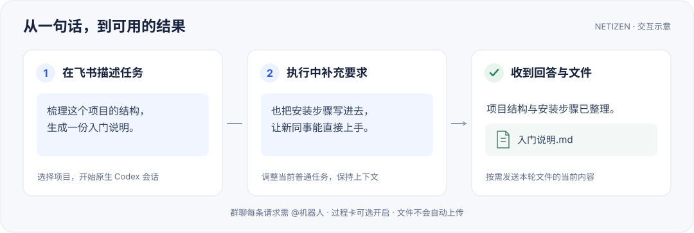

<p align="center">
  
</p>

<a id="netizen"></a>
<h1 align="center">Netizen</h1>

<p align="center"><strong>在飞书里使用 Codex。</strong></p>

<p align="center">
  在单聊、群聊和话题中发起任务、补充要求，接收结果与文件。<br>
  运行在自己的 Linux 或 macOS 主机上，复用 Codex 登录、原生会话、Skills 与 MCP。
</p>

<p align="center">
  <a href="https://github.com/lijingda/netizen/releases"></a>
  <a href="https://github.com/lijingda/netizen/actions/workflows/ci.yml"></a>
</p>

<p align="center">
  <a href="#快速开始">快速开始</a> ·
  <a href="skills/netizen-user-guide/references/user-guide.md">使用指南</a> ·
  <a href="docs/deployment.md">部署文档</a> ·
  <a href="docs/CONTRIBUTING.md">参与贡献</a>
</p>

<picture>
  <source media="(max-width: 600px)" srcset="docs/assets/workflow-mobile.svg">
  
</picture>

<a id="pilot-形态"></a>

## 你可以用它做什么

- **把任务交给 Codex。** 在飞书中阅读代码、修改项目、整理资料；任务由官方 Codex SDK
  管理的原生会话执行，沿用运行主机上的工具和工作目录。
- **边做边沟通。** 普通任务执行时继续发消息，可以补充条件或调整方向；也可以开启
  [过程卡](skills/netizen-user-guide/references/user-guide.md#飞书中的运行反馈)查看进展。
- **带上图片与讨论背景。** 支持图片、逐条引用，以及可选的
  [群聊上下文](skills/netizen-user-guide/references/user-guide.md#发送消息引用与图片)。
- **取回本轮文件。** 完成后从回复卡片中按需发送有原生执行记录的文件；发送的是点击时
  的当前内容，详见[文件说明](skills/netizen-user-guide/references/user-guide.md#查看和发送本轮文件)。
- **展开临时讨论，推进持续目标。** 用
  [Side](skills/netizen-user-guide/references/user-guide.md#side-临时话题)另开临时话题，或用
  [Goal](skills/netizen-user-guide/references/user-guide.md#goal)让 Codex 围绕目标持续推进。
- **让任务按时开始。** 用自然语言或 `/cron` 创建
  [定时任务](skills/netizen-user-guide/references/user-guide.md#定时任务)，每次执行在独立话题交付，之后可以继续交流。

普通会话的历史由 Codex 保存，可在 Codex App/CLI 中继续使用；App/CLI 中新增的消息不会
自动回填飞书。多个会话可以并行，同一项目的文件目录共享，修改会相互可见。

<a id="安装升级与启停"></a>

## 快速开始

### 1. 准备运行主机

| 需要 | 说明 |
| --- | --- |
| Linux 或 macOS | Linux 使用 systemd user；macOS 14+ 支持 Apple Silicon 与 Intel，需已登录桌面 |
| Python 3.11–3.14 | 需要 `venv`；生产运行不依赖 Node.js |
| 有效的 Codex 登录 | 先在运行服务的同一账号下通过 Codex CLI 或 App 登录；不要求全局安装 CLI |
| 飞书应用 | 安装器引导创建或选择机器人应用；按租户要求完成授权、审批、发布和可用范围设置 |

Netizen 面向一台主机上的受信用户，使用服务账号的 Codex 状态与工具权限。
Linux 注销后常驻需要 linger；macOS 服务随桌面登录启动、注销停止。
[完整前置条件](docs/deployment.md#前置门禁)

### 2. 安装正式版本

在准备运行服务的账号终端中执行，不加 `sudo`：

```sh
curl -fsSL https://github.com/lijingda/netizen/releases/latest/download/install.sh -o /tmp/netizen-install.sh
sh /tmp/netizen-install.sh
```

按安装器引导完成飞书应用配置。需要固定版本时，使用
[当前版本安装器](https://github.com/lijingda/netizen/releases/download/v0.6.0/install.sh)；
已有应用的权限也会在激活前检查。

由 Agent 代装时，先阅读[Agent 安装流程](docs/deployment.md#agent-驱动首次安装)，
按工具能力选择浏览器或凭据文件交接；不要把 App Secret 发到聊天里。

### 3. 在飞书开始第一次对话

1. 打开机器人单聊；如需在群里使用，先将机器人加入目标群。
2. 发送 `/settings`，创建或登记一个项目并启用。项目就是 Codex 实际工作的目录。
3. 发送 `/new`，在卡片中选择项目。需要过程卡时在此开启，默认关闭。
4. 直接发送任务，例如：**“梳理这个项目的结构，并生成一份入门说明。”**
5. 收到回复后继续交流；如果出现“本轮文件”，点击“发送”取回需要的文件。

群聊和群话题中的每条请求都需要重新 **@机器人**，包括命令。`/new` 只通过卡片创建会话，
不接受参数。普通任务执行中发来的新消息用于调整当前任务，不会排队成下一个任务。

安装遇到问题可从[部署文档](docs/deployment.md)继续；已能对话时，常见疑问见
[使用 FAQ](skills/netizen-user-guide/references/user-guide.md#常见问题)。

## 命令

日常使用可以从这些入口开始：

| 想做什么 | 入口 |
| --- | --- |
| 新建会话，选择项目 | `/new` |
| 查看并切换已有会话 | `/sessions` |
| 调整模型、思考强度和过程卡 | `/config`，当前会话空闲时使用 |
| 查看当前任务和上下文用量 | `/status` |
| 中断当前任务 | `/stop`；不保证前台工具进程退出，见[停止说明](skills/netizen-user-guide/references/user-guide.md#stop) |
| 管理定时任务 | `/cron`，也可以直接用自然语言描述计划 |
| 查看当前实例提供的命令 | `/help` |

重命名、归档、恢复、删除等完整用法见[命令索引](skills/netizen-user-guide/references/user-guide.md#完整命令索引)。
当前实例的命令开放情况以 `/help` 为准，任务状态以 `/status` 和卡片提示为准。

### 两个常见场景

**另开一个临时讨论。** 当前会话已有对话后，发送：

```text
/side 这个方案还有哪些边界情况需要考虑？
```

Side 会在同一聊天中新建话题，可继续多轮讨论。它与原会话共享项目目录，空闲两小时或
服务重启后过期；`/side close` 主动结束话题会话。Side 中不支持 Goal。

**每天回顾项目进展。** 在已经选择项目的普通会话中发送：

```text
每天北京时间九点，在当前群总结这个项目的进展。
```

计划每次创建独立执行话题；暂停计划不会停止已经触发的任务。
[定时任务用法](skills/netizen-user-guide/references/user-guide.md#定时任务)

<a id="admin-web"></a>

## 管理与维护

实例管理员可以通过 **Admin Web** 集中管理项目、会话、Side 话题和定时任务，
并在“系统维护”中检查正式更新或重启服务。默认地址为受信内网的
`http://<服务器 IP>:8787`，使用安装器生成的独立管理员凭据；
[访问方式](docs/deployment.md#配置与管理页访问)见部署文档。

升级与重启都会影响正在执行的任务，重启后不会自动续跑。
[正式升级、启停与卸载](docs/deployment.md#升级启停和卸载) ·
[管理页升级](docs/deployment.md#从-admin-升级) · [管理页重启](docs/deployment.md#从-admin-重启)

## 使用前了解

- **共享环境。** 飞书应用的可用范围和群成员关系控制谁能访问；同一实例复用服务账号，
  不提供按用户或项目隔离的权限体系。Admin Web 面向受信内网的单管理员。
- **输入与输出。** 当前请求支持文本、普通图片和富文本图片，文件和音视频不能作为任务输入。
  输出文件按本轮原生记录发现，不扫描工作区补齐，也不自动上传。
- **Codex 能力有宿主差异。** 飞书复用原生会话和工具，但并非每个 App/CLI 控件都可用；
  新会话采用 `auto_review`，不能完整继承 App 的 Ask/Custom。
  [完整差异与当前限制](skills/netizen-user-guide/references/user-guide.md#与-codex-appcli-的差异)

<a id="用户指南-skill"></a>

也可以直接在飞书问 **“Netizen 怎么切换会话？”**。安装器随版本提供
[用户指南 Skill](skills/netizen-user-guide/SKILL.md)，支持自然语言咨询；
需要显式调用时，发送 `$netizen-user-guide 你的问题`。

<a id="本地开发"></a>
<a id="开发与兼容性验证"></a>

## 文档与贡献

| 你的任务 | 从这里开始 |
| --- | --- |
| 查命令、理解操作后果或排查使用问题 | [用户手册](skills/netizen-user-guide/references/user-guide.md) |
| 安装、配置应用权限、升级或恢复服务 | [部署文档](docs/deployment.md) |
| 准备开发环境、运行测试、提交改动 | [贡献指南](docs/CONTRIBUTING.md) |
| 理解系统与修改实现 | [工程设计](docs/design.md) · [领域词汇](CONTEXT.md) · [架构决策](docs/adr/) |

欢迎通过 [Issues](https://github.com/lijingda/netizen/issues)反馈问题或提出建议，也欢迎
提交代码与文档改进。开发当前工作区请按贡献指南使用 `./dev-install.sh`；
正式版本安装使用上面的 `install.sh`。
