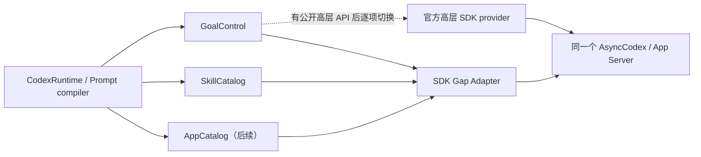

# 用可逐项移除的薄 Adapter 补齐 Python SDK 高层能力缺口

> `/skills` 浏览入口已由
> [ADR 0018](0018-remove-skills-command.md) 删除；本 ADR 定义的 SkillCatalog 与
> `$skill-name` live revalidation 边界继续有效。下文保留原决定的历史背景。

## 背景

Netizen 的主边界仍是官方 `openai-codex` Python SDK 高层 facade。不过当前 SDK
已经携带 App Server 的 Goal、Skills 和 Apps 协议模型及部分低层编排能力，却尚未在
`AsyncCodex` / `AsyncThread` 上提供完整高层方法。继续把这些能力全部隐藏，会让飞书
无法接近 Codex 原生的 `/goal`、`$skill` 和 `$app` 使用习惯；另起 App Server、复制
协议或用 Prompt 模拟又会破坏单一原生 Thread 和单一运行时边界。

[官方 App Server 文档](https://learn.chatgpt.com/docs/app-server#api-overview)把
`thread/goal/set|get|clear`、`skills/list` 与 `app/list` 列为协议能力；
[显式 Skill 调用](https://learn.chatgpt.com/docs/app-server#start-a-turn-invoke-a-skill)
由文本中的 `$<skill-name>` 和同一 Turn 中的 typed `skill` input 共同表达。Goal 是
持久化状态并可自动产生后续 Turn，因此不能把它当作一次普通 RPC 或一次普通 Turn。

## 决定

引入一个临时的 **SDK Gap Adapter**，只补齐“官方 App Server 已支持、当前 Python
高层 facade 尚未支持”的精确能力。它是 SDK 边界上的兼容件，不是第二套 Codex
gateway。

### 1. 一个兼容边界，多个窄能力口

- 生产仍只创建一个 `AsyncCodex()`。Adapter 复用它已经初始化的同一个 App Server
  连接；不得启动第二个客户端、第二个子进程或第二套通知循环。
- Runtime 只依赖 `GoalControl`、`SkillCatalog`、未来的 `AppCatalog` 等语义口，不依赖
  Adapter 类，也不接触 SDK 私有类型。
- 初版可以由一个小文件、一个 Adapter 对象实现多个口，不创建 provider registry、
  plugin framework 或通用 transport abstraction。每个口仍有独立的结构校验、可用性
  结果和 composition binding；Goal 形状损坏不能连带关闭 Skills。只有代码实际增长到
  不能审查时才拆文件。
- Adapter 内每项能力都固定 method、typed params、typed response 和副作用类别；不
  对外暴露 `request(method, params)`、字符串 method 参数或任意响应模型。
- 请求/响应模型直接复用安装 SDK 生成的类型，不复制 App Server schema。Adapter
  返回少量 Netizen DTO 或 opaque handle，绝不把 `_GoalOperationState`、绝对 Skill
  path 等内部对象泄漏到 Channel 层。

### 2. 不按版本号许可，按契约和 harness 放行

Adapter 不维护 SDK 版本 allowlist，也不校验整个包或 Goal 私有文件的源码 fingerprint。
仓库仍可为了可重复构建使用 lockfile 或 exact dependency constraint，但版本号不是
Adapter 的能力门禁；SDK 升级是否可用由契约 harness 决定。构建产物必须携带已经运行
harness 的实际 resolved SDK/App Server，不能在发布后原地解析或替换为未经测试的新包。

这是一个有意的取舍：结构检查只能证明 shape，不能证明私有 Goal 编排的语义完全未变；
因此任何 SDK 变更都必须先经过使用真实安装 SDK client 的 synthetic harness 和目标
环境 live probe。我们接受“不对每个版本做运行时白名单”的兼容策略，但不接受绕过
upgrade/release gate 部署一个未验证构建。

构造 Adapter 时只做便宜、确定的 fail-closed 结构检查：

- `AsyncCodex` 已初始化，且能取得同一个 SDK-owned async client；
- 当前能力需要的 typed request/response、字段 alias 和低层 callable 存在；每项能力
  独立校验并独立返回 available/unavailable；
- Goal 所需的 route/register/start/notification/cleanup 形状完整；
- experimental method 仍单独要求 App Server capability opt-in。稳定 Goal/Skills/Apps
  不因共用一个 Adapter 而继承 experimental 权限。

结构检查失败只让对应 capability unavailable，并从命令帮助隐藏；不能悄悄改走 Prompt
或另一条 RPC。若失败发生在已发出 mutation 之后，则保留该 Binding 的占用状态并按
未知副作用 fail closed。现有 terminal cleanup 不属于这次放宽：它继续完整保留 ADR
0009 的精确版本、整包 fingerprint 和 `experimentalApi` 门禁，除非另有独立决策。

### 3. Provider 逐项替换，不做运行时自动 fallback

composition root 为每个语义口显式选择一个实现：当前缺口使用 App Server Adapter；
高层 SDK 支持并通过同一套行为探针后，切到 `SdkGoalControl`、`SdkSkillCatalog` 等公开
实现。Goal 切回 SDK 不要求同时删除 Skills Adapter，反之亦然。

不能在一次请求失败后从高层 SDK 自动 fallback 到 Adapter。mutation 可能已经生效，
自动重试会重复创建 Goal 或产生另一轮副作用。SDK facade 新增候选方法时，upgrade
harness 应报告 `migration-required` 并阻止合入，直到完成语义对齐、显式改线和删除该
能力的 shim。

## Goal 设计

### 产品入口

- `/goal`：读取当前 Binding 的原生 Goal 并显示卡片；lazy Binding 尚无原生 Thread
  时显示“未设置”，不为只读操作创建 Thread。
- `/goal <objective>`：在当前 Binding 上启动原生 Goal。lazy Binding 在这里先创建并
  write-once 绑定 native Thread，因为启动 Goal 已经是真实原生活动。Binding 已有
  running/stopping 普通 Turn 或 `compacting` 槽位时，在 Binding 锁内受控拒绝，不能
  依赖底层 SDK 的裸 idle 错误处理互斥。
- `/goal pause|clear`：对当前 Goal 做显式控制；卡片按钮进入同一 typed control 路由。
  `/goal resume` 只有在 provider 能先安全注册 Goal route、再把既有 Goal 设回 active
  并通过 rollover 探针时才启用，绝不能复用会先 clear 的“新建 Goal”路径。
- `/status`、`/sessions` 展示 `goal-running`、`goal-paused`、`goal-blocked`、
  `goal-budget-limited`、`goal-complete` 等原生状态，不把它们压成普通 Turn 状态。

首版不必一次暴露所有 Goal 选项。尤其 token budget 只有在当前 provider 能原子提交并
通过探针时才显示；不能因为 generated model 有字段就假设低层启动 helper 已支持它。

Goal 的自动 continuation 完全继承原生 approval 与 sandbox 姿态，不在 Netizen 增加
第二套权限系统。当前 SDK 未注入自定义 handler 时，会自动接受命令执行与文件修改的
approval request；这意味着一次 Goal objective 可触发多个没有逐消息人工 checkpoint
的物理 Turn。Goal 上线前必须明确审查目标环境的原生 sandbox/approval 配置是否适合
这种无人值守执行，不能把普通 Turn 已接受的姿态未经评估直接外推到 Goal。

### Runtime 生命周期

Goal 在 Runtime 中是一个 `GoalOperation` 槽位，而不是一串彼此独立的 Active Turn：

1. Adapter 复用 SDK 低层已有的 Goal 注册、首轮等待和通知路由；Netizen 不重新实现
   自动 continuation 算法。当前 SDK 的多物理 Turn 合并器存在于未被高层实例化的私有
   `_AsyncGoalNotificationStream`。Gap provider 可以在内部驱动这个已安装实现，但不能
   复制它；该类或构造契约缺失时 Goal 整体 unavailable。
2. Adapter 返回 opaque `GoalHandle`，只暴露 logical operation ID、事件迭代、pause/
   close 等窄操作，不泄漏私有 state。通知流用于进度和物理 Turn rollover；权威终态仍
   由固定 `thread/goal/get` 加公开 `thread.read()` 交叉确认。流、Goal 状态和 Thread
   状态不一致时 fail closed，不能为了释放槽位自行猜测。
3. Goal active 时，当前 Binding 的普通 Prompt、`/compact` 和 `/config` 先明确拒绝；
   首版不实现跨自动 rollover 的 steer。`/new` / `/resume` 仍可切换 Scope 的 active
   Binding，不会暗中停止旧 Binding 的 Goal。
4. `/goal pause` 先确认 persisted Goal 已暂停，再处理当时仍 active 的精确物理 Turn；
   `/stop` 若映射到 Goal，必须复用这条路径并保留 ADR 0010 对 foreground process 的
   警告。pause、interrupt 或 terminal cleanup 结果未知时保持 Goal 槽位，不允许同一
   Binding 开新 Turn。
5. 只有原生 Goal 进入 terminal/pause 状态、当前物理 Turn terminal、Thread idle，且
   Adapter 的逻辑流完成，才释放运行槽。一次 goal/set 响应或单个物理 Turn completed
   都不是整个 Goal 完成。

新 Goal 只允许走 `start_goal_operation` 的 clear -> set(active) -> wait-first-turn 路径。
resume 必须为既有 Goal 先注册 route，再执行 set(active)；restart reconcile 首先只读
`goal/get`，不能调用 start。当前 SDK 启动 helper 在独立线程中运行并自行处理调用方
cancellation，Adapter 不得与它并发执行第二套 pause/unregister 清理。

Goal 状态仍只保存在 Codex。Channel SQLite 不增加 Goal、budget、物理 Turn 或
continuation 表。服务重启或外部 CLI 可能留下 active persisted Goal；重新进入该
Binding 时必须先 `goal/get` 对账。若没有可安全重建的 SDK Goal route，则把该 Binding
标为 `externally-active-goal` 并拒绝普通 Turn，只允许经过验证的 pause/clear/reconcile，
不能猜测已完成、重挂一个可能漏事件的逻辑流或启动第二个 Goal。

### Goal 与 Skills/Apps 的组合边界

当前 `thread/goal/set` 只接收 objective/status/budget，不接收 Turn input items。因此
`/goal $code-review $test-triage 检查当前改动` 可以先用 catalog 校验两个引用，再把原
文本作为 objective 提交；但不能宣称 Goal 自动产生的首个物理 Turn 已经附带两个 typed
`SkillInput`。官方文档只保证普通 Turn 的文本 `$name` 可以触发解析，并未保证 Goal
objective 具有相同语义。因此上述组合必须通过 live probe 后才启用；未证明时，`/goal`
中的 Skill/App reference 显式拒绝而不是降级成看似成功的纯文本。若将来协议或高层 SDK
允许 Goal 携带结构化 input，再逐项增强。普通 Prompt 和 running Turn steer 不受此
限制。

## Skills 与 Apps 设计

### Skills 第一阶段

Adapter 只补 `skills/list` discovery；实际 Turn/steer 继续使用已经公开的
`SkillInput(name, path)`：

1. 按 Binding 的 canonical Project cwd 获取 live catalog；展示时不把绝对 path 编进
   飞书 callback。
2. 普通消息可包含多个 `$skill-name`。解析器保留原文本，并为每个成功解析的引用追加
   一个 typed `SkillInput`，整体仍只启动或 steer 一个原生 Turn。
3. 提交前重新 list/revalidate：Skill 必须 enabled、属于当前 cwd 可见 catalog，且
   name/path 精确匹配。未知、重复名称跨 scope 歧义或 stale 选择必须显式失败，不能
   自行挑第一个，也不能接受用户提供的任意本地 path。
4. `skills/list` 返回的逐 cwd errors 必须展示或使相关 cwd fail closed；
   `skills/changed` 初版不必建立常驻监听，因为无持久缓存，下一次展示/提交都会重读。

“保留 `$name` 文本并附加 typed input”是官方 App Server 文档推荐的同一次显式调用
形状，不是执行两次；synthetic/live probe 仍要断言一个引用只注入一次 Skill 指令。

原决定由 `/skills` 负责浏览与插入引用，不代表执行一个 Skill；真正执行仍是包含
`$skill` 的 Prompt。该浏览入口已由 ADR 0018 删除，当前用普通自然语言消息查询目录，
显式执行和提交前校验仍使用 `$skill-name`。一个消息只允许一个 slash control 或一个
Prompt 的边界不变。

### Apps 后续按同一模式接入

`AppCatalog` 可用固定 `app/list` 做 cursor 分页，提交时校验 accessible/enabled，再用
公开 `MentionInput(name, "app://<id>")` 附到普通 Turn。`$skill` 与 `$app` 发生同名
歧义时必须让用户选择类型。Apps 的安装、鉴权和配置写入不在这个薄 Adapter 的首批
范围；Plan/collaboration mode 也不因为有了 Adapter 就自动获准，实验或会改变
turn/start 语义的能力仍需单独决策。

## SDK 升级 harness

每次 `openai-codex` 或随附 App Server 升级，必须运行同一套 capability harness；不靠
人工记住“检查一下”。它至少包含：

1. **Facade inventory**：记录高层 Goal/Skills/Apps 是否已经出现；发现候选公开方法时
   产生 migration-required 失败，而不是永久保留 shim。
2. **Shape contract**：按能力分别验证 Adapter 使用的 ownership edge、callable
   signature、生成 models、字段 alias 和序列化；不比较版本号或全包 hash。
3. **Synthetic App Server**：必须让真实安装的 SDK client 连接 fake stdio transport，
   而不是 mock 掉 SDK internals；断言每个 adapter method 的 exact method/params/response，
   route-before-mutation、多物理 Turn Goal 的逻辑 stream、即时通知竞态、pause/clear、
   未知 mutation fail-closed，以及 Skills errors/重名/stale revalidation。
4. **Live stable-surface probe**：在临时受信 Project 上先证明零 Turn 的新 Thread 已经
   persisted，再验证 Goal start -> continuation -> pause/resume -> terminal ->
   same-Thread normal Turn、进程重启后的 active Goal reconcile，以及 `skills/list` 后
   多个 Skill 的 typed Turn 与 steer。另行证明 Goal objective 中的 `$skill` 是否真的
   生效，并确认“文本 marker + typed input”不会重复注入。Goal 灰度前还要记录目标环境
   的实际 sandbox/approval 姿态，并用有界、无破坏的多 Turn Goal 验证无人值守审批行为
   与部署预期一致。
5. **既有回归矩阵**：models、compact、completion recovery、steer、interrupt/
   terminal cleanup、CLI exact-ID resume 和 Linux config compatibility 仍必须通过；
   新 Adapter 不能改变它们的单 App Server 与 exact Binding 语义。

repository check 运行 shape 与 synthetic 部分；需要真实凭据/标准 `CODEX_HOME` 的 live
probe 仍作为 SDK upgrade/release gate，并输出 SDK/App Server 版本与 capability 结果供
审查。任一 mutation 语义无法确认时，该能力不发布，但其他通过的能力可以继续使用。

## 分阶段落地与移除

1. 首阶段已落 Adapter ownership/shape harness 和 `SkillCatalog`，当时启用了
   `/skills` 与普通 Prompt/steer 的多个 typed Skills；ADR 0018 后只保留后者。
2. 再落 `GoalControl`、GoalOperation 槽位、pause/stop/restart 对账和完整 Goal live
   probe；通过前 `/goal` 继续 unavailable。
3. Apps 只有在确有产品入口时按同一模式增加；不预先搭框架。
4. 某项高层 SDK 能力通过 parity harness 后，单独切换该 port、删除对应 method 常量、
   私有 import、shape 断言和 synthetic shim case；保留行为级测试作为公开 provider
   contract。最后一项 shim 删除后，整个 SDK Gap Adapter 文件一起删除。

本 ADR 同步修订 AGENTS.md、ADR 0008/0009/0012 与 design 中“terminal
cleanup 是唯一例外”的绝对表述；例外改为本 ADR 定义的 capability-specific 边界，
通用/private RPC gateway 的禁令继续保留。现有 experimental terminal cleanup 的
实现和 ADR 0009 版本/指纹门禁保持原样，不与新 Adapter 合并；它仍保留独立
experimental capability 和 ADR 0010 的产品语义。SDK Gap Adapter、Goal Operation
与 Externally Active Goal 的权威术语记录在 CONTEXT.md。

## 后果

飞书可以在不复制 Codex 状态、不启动第二个 App Server 的前提下逐步接近原生 Goal、
Skills 和 Apps 体验；SDK 每支持一项即可删一项兼容债务。代价是共享 SDK 私有 ownership
edge 与 Goal 低层编排仍属于临时风险，必须由结构检查和黑盒 harness 共同约束。版本号
变化本身不再阻断升级，但任何无法证明的协议或生命周期变化都会让对应能力 fail
closed。
