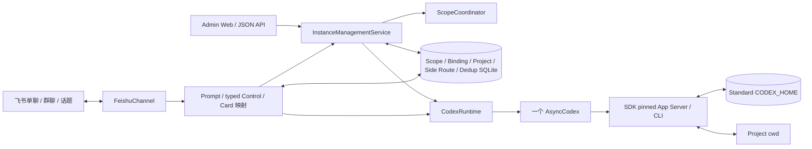

# Netizen Python Pilot 设计

## 目标与边界

目标是让少量受信用户在一台受支持的 Linux 或 macOS 主机上，通过飞书单聊、群聊和话题使用原生 Codex。
飞书只是新的 Channel；历史、工具、Skills、MCP、配置、sandbox 和认证仍由 Codex
管理。Project Registry 可通过飞书设置卡片或 Admin Web 管理；当前仍不实现审批卡、Codex 原生配置
值的 idle read/update、文件/音视频作为 prompt 输入、流式 token、HA 或
durable queue。普通 Turn 的结构化本轮文件可在终态卡片中按需发送；普通图片
和富文本图片按 [ADR 0015](adr/0015-support-native-image-inputs-for-message-and-quote.md)
作为原生视觉输入支持。

## 架构

业务只有一个 Python 服务。Admin listener 和 `FeishuChannel` handlers 都运行在 Channel
background loop，且只构造一个 Store、Project Registry、Runtime 与 `AsyncCodex`。App
Server 是 `AsyncCodex` 的子进程，不是第二套业务服务。

## 核心模型

Scope 分为 P2P、群聊主线和真实 topic。Binding 保存本地 UUID、Scope、Project
alias、可空 write-once native Thread ID、可选的 Binding-scoped Model/Effort/Speed
目录 ID、settings revision、Mention Context Mode、Context Boundary、context revision、
creator 和时间；Scope 只保存 active Binding 指针。P2P 固定为 `current-only`；普通群聊
主线与群话题可在 `current-only|catch-up` 中选择，默认 `current-only`。Side 不是普通
Binding，也不形成配置继承链；创建时冻结 Parent 当时的 Model/Effort/Speed 与 Task
Feedback，之后独立，Mention Context Mode 固定为 current-only。

exact `/new` 是普通用户创建会话的唯一入口；任何 `/new ...` 参数都零 mutation 地拒绝。
它打开 Card 2.0，提交只写入包含 Project、可选 Turn Settings 和 Mention Context
Mode 的 lazy Binding，不要求任务、不创建 native Thread；完整表单及目录降级语义见下文。
下一条需要启动新 Turn 的普通消息执行：

1. 若有 Binding 配置，在进入 native mutation 前重新调用 live `codex.models()`，按所选
   Model 验证 Effort/Tier 并解析 wire value；
2. lazy Binding 调用 `thread_start(cwd=canonical_project_cwd)` 并 write-once 保存
   Thread ID；已有 native ID 则只 `thread_resume(exact_id)`；
3. `thread.turn(prompt, **override)`，没有 Binding 配置时 kwargs 为空；
4. native handle 返回并完成 ID 校验后保存内存 active Thread/Handle，随后后台轮询公开
   `thread.read()` 的原生状态；Binding 配置不清除，供后续新 Turn 重复使用。

已有 native ID 时只调用 `thread_resume(exact_id)`，不传 cwd、approval、sandbox、
model、config 或 env override。
`thread.turn()` 若没有返回 handle，其副作用结果无法确认：服务立即关闭全部新
admission 并要求重启，不能把 Binding 当 idle 再启动第二轮。

没有 Binding 配置时 `thread.turn()` 不传 `model`、`effort` 或 `service_tier`，由共享
标准 `CODEX_HOME` 的原生 Codex 默认值或既有 Thread 当前设置决定。有配置时，Netizen
在自己启动的每条真实 `thread.turn(input, model=..., effort=..., service_tier=...)`
上重新校验并显式应用。
`/config` 不调用带 override 的 `thread_resume()`，也不声称能读取 Thread 当前值。
模型目录失败、选项下线或不兼容时不会 start/resume/turn，Binding 配置保留供用户重新
配置；`turn()` 返回结果未知时同样保留并关闭 admission。

running Turn 的普通输入仍只调用 exact handle `steer()`：即使 Binding 有配置，也不读取
模型目录或应用它。`/config` 在 running/stopping、Goal active
或 compacting 时明确拒绝。settings/context revision 同时进入 submission admission；
引用、补充历史、图片或 Skill 准备期间配置或 Context Boundary 发生变化时，本条消息不
执行并要求重发。

Mention Context Mode 按
[ADR 0039](adr/0039-add-binding-scoped-mention-catch-up-context.md) 保持群聊逐条 @ 的准入不变：

- `current-only` 只投影当前 @ 消息及用户显式选择的一条逐条引用；
- `catch-up` 在收到有效 @ 消息后才按需读取同一 group-main 或 ordinary-topic Scope 中，
  上一条已接受 Context Boundary 之后、当前消息之前的 eligible 非 bot 成员消息。历史中的
  `/control` 和 `$skill` 都编码为 inert supplemental context，不会自动触发任何动作；
- P2P 与 Side 不读取补充历史。未 @ 的消息不会直接 start/steer，也不会由 Channel 缓存或
  写入 SQLite；只有最终 native input 进入 Codex 原生历史。

Context Boundary 是 Binding-scoped exact 飞书消息 marker，不是机器人回复时间。`/new`
创建 catch-up Binding、`/resume`、`/unarchive` 或从 current-only 切换为 catch-up 时，以
exact control/card message 重置边界，避免补录 Binding 非 active 期间的讨论。start/steer
被 native Runtime 确认接受后，Runtime 才在同一 Binding lock 内 CAS 推进边界；失败、竞态
拒绝或准备超时不推进。若 native 已接受但 SQLite commit 失败，Runtime 保留 active tracking、
关闭全局 admission，并明确报告任务已接受但边界未持久化。

补充历史由一个进程内、只读的 official `lark-oapi` typed reader 按需读取；它复用同一
App ID/Secret，不创建第二个 Channel/WebSocket。群主线使用 exact chat container 并排除
topic replies，普通话题使用 exact thread container；lower/upper 都通过 exact message ID
核验。一次读取最多 10 页/500 条 raw message/60 秒，最多保留最近 50 条 eligible message、
64,000 字符 supplemental visible text，候选 exact fetch 最多 4 路并发。图片与当前/引用
消息共用 20 张、单图 20 MB、总计 50 MB 的原有准入限制。模型可见 envelope 只用 compact
`context_status` 披露省略数量与是否截断，完整扫描/筛选统计留在服务端；提交前可见回执仍
披露带入与不完整状态。被选中消息的 Scope/identity/资源失败则整条 fail closed。候选
identity 只用应用内 `open_id` 与 user/bot 类型交叉核验；Prompt attribution
的发送者姓名优先使用历史列表同条消息内嵌的 `sender_name`（仅作展示，不参与身份一致性
判断），exact message 经 Channel SDK 归一化的 `display_name` 只在其缺失时兜底，两个
来源都不可验证时才整条 fail closed。`sender_name` 由消息 API 的 `with_sender_name`
参数投影，不需要通讯录权限，也不受应用通讯录权限范围限制。完整历史语义与上线 live
probe 见 ADR 0039。

每个真实普通或 Side Prompt 在进入 Runtime 前都按
[ADR 0029](adr/0029-project-current-message-provenance-into-prompts.md) 投影 exact Current
Prompt Message。投影使用 Channel SDK 公开的消息 ID、`text/image/post` 类型、内容保真度
和 `Identity` 字段；发送者只作 attribution，不改变 owner、共享控制权、approval 或指令
优先级。[ADR 0030](adr/0030-require-resolved-current-sender-names.md) 开启 SDK 公开的 chat
member roster 姓名补全，并要求当前 sender 具有真实显示名；缺名时在引用读取或图片下载前
零 start/steer，明确提示 `im:chat.members:read`，不再生成“未知发送者”。sender 只投影
`display_name`、应用内 `open_id`、`is_bot` 和 `sender_type`；不把跨应用 `union_id` 或
租户级 `user_id` 写入 Codex 历史。无补充上下文且无逐条引用时，归一化请求正文位于最前，
版本化 attribution trailer 位于末尾且不重复正文；只有引用时使用 v4 JSON envelope；
catch-up 使用 v2 `feishu_message_context_prompt` envelope，顺序固定为 supplemental
messages、可选且去重的 quoted message、最后的 current message，且
`current_message.request_text` 保持完整。supplemental/quoted 共用 compact Historical
Message，并与 current message 保持 `text`/`request_text` 的语义边界。这些输入都会进入 Codex 原生历史，
但不写 Channel Database。来源消息 ID/sender 与同次解析冲突时整条 fail closed。

普通消息开头的连续 `$skill-name` 引用由 Prompt compiler 在当前消息上解析。Runtime
先捕获 exact admission，再按 canonical Project cwd 调用 live `skills/list`；每个名称
必须唯一、enabled 且来自该 cwd 的目录，随后保留原文本并追加公开
`SkillInput(name, path)`。多个 Skill 仍只对应一次 `turn()` 或一次 exact `steer()`；
discovery 期间不持有 Binding 锁，返回后用 admission revision 防止任务状态被重解释。
被引用历史中的 `$` 会在版本化 quote envelope 中编码为非激活文本，不能把历史内容
变成当前 Skill 调用。

Runtime 保留基于公开 `AsyncThread.compact()` 和 history read 的压缩 controller，供兼容
重验使用。它先记录已有 Turn ID，再保留 Binding 的 `compacting` 槽位，直到
`thread.read(include_turns=True)` 出现且仅出现一个新的 terminal
`contextCompaction` Turn 且 Thread 回到 idle；首次 idle read 不能单独证明完成。固定
`0.147.0` 的真实探针虽能确认该终态，却未能成功完成同一连接的后续普通 Turn。当前
`/compact` 因此注册为 unavailable、不进入 `/help`，输入时明确失败且不调用 controller；
不增加临时 workaround。完整决定见 ADR 0013，当前兼容性结论见
`docs/deployment.md`。

`/goal <objective>` 在当前 Binding 上启动原生 persisted Goal。lazy Binding 先创建并
write-once 绑定一个已持久化、idle、非 ephemeral 的零 Turn Thread；若公开 read 不能
证明这一点，Goal 明确不可用。Adapter 返回一个 opaque logical handle，SDK 自己把自动
continuation 的多个物理 Turn 合并为一个通知流。`/goal` 只读展示，`pause/resume/clear`
和 Goal 卡片按钮进入同一 typed control 路由；Goal 模块显示 objective、tokens used 与
可用的 token budget，不显示耗时。Goal start、过程、
pause/resume 与终态复用同一张组合回复卡，Goal 模块承担状态和暂停/继续/结束按钮；切换
Scope 的 active Binding 不会使原卡失去对其 exact Binding 的控制权。
Goal Activity 不通过普通 queue observer 读取；Adapter 在现有 logical stream 的唯一消费链
内先做安全 Tap，再把原通知交还 SDK。每次 exact `turn/started` 切换物理 Turn 时，Runtime
原子替换 physical identity，并清空上一轮 checklist、commentary、operation 与 cursor；
迟到旧 Turn 事件忽略。Goal Module 跨物理 Turn 继承，Activity 每轮重置，中间 Turn 不产生
Result/Files；logical terminal 只用 exact 最终物理 Turn 的输出和 structured files，不回退、
不拼接历史，也不扫描工作区。

会话生命周期的命令入口按 [ADR 0017](adr/0017-manage-native-thread-lifecycle.md) 与
[ADR 0037](adr/0037-reconcile-native-thread-delete-with-a-thin-gap-adapter.md) 管理当前 Binding，
运行态观测与 Thread removal 委托按
[ADR 0049](adr/0049-bound-turn-observation-and-delegate-thread-removal.md)：
`/rename [name]` 写原生 Thread name；`/archive` 先显示确认卡，提交时再次确认 exact
Binding 仍为 Scope active。归档成功后只清空 active pointer 并保留 Binding/Turn
Settings。`/delete` 为 Lazy Binding 显示只删本地记录的确认卡；materialized Binding
还把 exact native ID 固定进危险确认卡，只有原生正常返回或四视图明确 absent 后才删除
本地 Binding。
普通 `/sessions` 显式读取 `thread_list(archived=False)`，`/sessions archived` 显式读取
`archived=True`，归档状态与名称都不进 Channel Database。普通列表卡片的“设为当前”只
切换 exact active Binding，不创建 Turn，也不停止其他 Binding 的运行。按
[ADR 0036](adr/0036-archive-exact-idle-sessions-from-the-sessions-card.md)、
[ADR 0038](adr/0038-delete-exact-idle-sessions-from-the-sessions-card.md) 与 ADR 0049，每个
materialized persisted 行都可确认后 exact archive/delete，不以本地 Turn、Goal、Compaction
或观测状态作为资格门禁。Runtime 只占用 exact Binding 的 lifecycle intent 阻止新 Turn，
然后释放 Binding/Scope lock 并直接委托 App Server。inactive 目标保持 active pointer，当前目标
清空 pointer。Lazy 删除仍只删本地 Binding。`/sessions archived` 为 exact archived Thread
提供独立两阶段 Delete，并与 active 列表共用同一原生 primitive；最终只把 root ID
交给 App Server 级联删除 spawned descendants。归档恢复仍显式选择目标：
`/unarchive <短 ID>` 或归档卡按钮恢复 exact native ID 并切换 Binding。

`/side [首轮问题]` 按 [ADR 0021](adr/0021-support-multi-turn-ephemeral-side-topics.md)
从当前 exact active、materialized Parent Binding 创建
`thread_fork(parent_id, ephemeral=True)`。Parent 普通 Turn 正在 running 时允许，
stopping、Goal、compaction、lifecycle unknown、外部 active 或 Lazy Binding 拒绝。
fork 后读取 exact ID/ephemeral/parent shape，并通过固定 Side Adapter 注入不可由用户
修改的边界。Parent active pointer 或配置后续变化不传播到已创建 Side；Side 保存创建
时解析出的 Binding Turn Settings 快照，在同一个 ephemeral Thread 上重复用于后续新
Turn。Parent 和多个 Side 可并发，共享 canonical Project cwd 而不增加 Project 锁。

创建请求先按 `(app_id, source_message_id)` 原子写 `creating` route，再向 underlying
chat fresh send 根卡片。从已有话题触发也不能 reply 当前消息，因此结果是同级 sibling。
若根消息响应已有 `thread_id` 则直接采用；否则对 exact 根消息发送 seed，并固定
`reply_in_thread=True`、`reply_target_gone="fail"`。带首轮问题时，两种返回路径都会
向 exact 根消息发送一条明确标注来源的问题 seed，作为首轮 origin 和 reaction anchor；
展示副本有界并中和飞书 `<at>` 标签，送给 Codex 的原始问题不变。首轮 Current Prompt
Message 始终是原 `/side` 入站消息及其真实发送者，seed 只是 Completion Origin；原 control
即使带普通 reply relation 也不会扩大为逐条引用。无首轮问题且根响应
没有 `thread_id` 时，必要 seed 只提供简短的首条问题引导。每个 send 都校验 raw
message/chat/root/parent/thread 关系、code、分片和 success；来源 topic 与新 topic 相同
时失败。root/seed 使用稳定且互异的确定性 UUID；transport exception 或 retryable result
只以相同 UUID 对账重发一次。目标飞书必须 live 验证重放返回原消息的 exact identity 且不
重复建话题，否则 Side unavailable。公开接口没有 lookup-by-UUID，所以两次响应都丢失时
或服务端接受 fresh root 后进程在持久化 identity 前崩溃，仍可能留下无法由本地 route
发现的 orphan topic；永久墓碑只覆盖已持久化 root/topic identity 的 Side，本地单测不能
消除这个 V1 crash window。首轮问题只在新话题显示并执行；Parent 创建成功后不发文字回复，
错误仍在来源位置明确报告。

Side Topic route 不是新的 ScopeKind。消息先按 exact topic ID 查 Side，再按 inbound
root ID 回退，只有未命中才进入普通 Scope/Binding。P2P/P2P topic 依据 underlying
`chat_type=p2p` 免 @；群主线和各类群话题仍逐条要求 @。`closed/expired/failed`
墓碑永不转成普通 Binding；open route 缺少内存 Session 时立即转 expired。

## 运行与锁

内存状态以 Binding ID 为键：普通 Turn 保存 handle、owner、origin message、
running/stopping/turn-observation-unavailable 的单轴公开状态、completion task、receipt
Event、只读 Activity cursor/checklist/commentary/operations、成功 steer count 与 freshness；
原生压缩保存 exact Thread、
baseline Turn ID、compacting task 和 receipt Event；Goal 保存一个
`starting/running/pausing/external-active/unknown` 的逻辑操作槽、opaque handle、
persisted snapshot、cleanup barrier 与 receipt Event。Scope 锁只保护
new/resume/active pointer 与 stale lifecycle 卡片校验；Binding 锁保护首次 start、
steer、stop、compact、短暂的 rename/archive/delete/unarchive lifecycle 槽和 terminal
cleanup。不同 Binding 不互锁，也没有全局/Project semaphore。

普通持久 Thread 的连接订阅按 [ADR 0028](adr/0028-release-idle-persistent-thread-subscriptions.md)
由 Runtime 保存瞬态记录。当前 active Binding 每次原生操作精确回到 idle 后保留十五分钟
warm window；切换 `/new`、`/resume` 或 archive/unarchive 使某个 idle Binding 不再 active
时立即尝试取消其订阅。策略没有 Thread 数量上限或 LRU，不扫描 SQLite，也不在进程重启
时 resume Thread 或重建 timer；新进程从零条已知订阅开始。下一条消息仍用保存的 exact
native ID 公开 resume，因此 Binding、历史与 Turn Settings 都不变。

释放 timer 不计入普通 `wait_idle()`，但与对应 Binding 的 start/resume、active pointer
变化及终态在同一锁和 generation 下防止 ABA。pointer 已持久化变化后先保护新的 current，
timer 也会复核它是否由 inactive 变成 current，过期的 inactive 策略不能释放新 current。
到期后必须再次公开 read exact Thread，且只有 `idle`、没有普通 Turn/Goal/compaction/
lifecycle 槽、没有 App Server 登记的后台 terminal 时才 unsubscribe。公开 read 返回
`notLoaded` 不是 unsubscribe 成功证据。检查失败、external active、未知状态或存在
terminal 都保留订阅并等待新的完整空闲窗口；unsubscribe unknown 在成功 exact resume 或
确认 unsubscribe 前始终保持 unknown。自动释放绝不 cleanup、terminate 或 signal 进程。
shutdown 先禁止新 timer，取消并排空已有 timer，再关闭 Codex transport。

`thread/unarchive` 只恢复归档 rollout；Runtime 随后必须 exact `thread_resume`，并只用
resume 返回的 handle 建立订阅记录。`/release` 只显式释放当前 active 普通 Binding 的当前
连接订阅；Lazy Binding 或本来未订阅是幂等成功，busy、后台 terminal 与状态未知都明确
拒绝。`/status` 展示的也只是本 Netizen
进程的瞬态订阅投影。`unsubscribed`、`notSubscribed` 或 `notLoaded` 不表示 Thread 被删除，
也不表示 writer 立即释放：最后一个订阅者离开后，App Server 仍要求连续三十分钟没有订阅
和活动才会卸载 Thread。

Side 另有以 Side ID 为键的内存 Session registry 和独立锁/admission revision；它不占用
Parent Binding 的 active 槽。idle 消息对同一 ephemeral `AsyncThread` 新建 Turn，running
消息只 steer exact handle。引用、图片和 Skills 准备前捕获 Side revision，提交时防止
close/expiry 或 idle -> running -> idle ABA。Side 内只允许 Prompt、`//`、`/status`、
`/stop`、`/help`、`/` 和 `/side close`，其他 Binding lifecycle/config/Goal control 和
嵌套 Side 均拒绝。创建时还在 Parent admission 中冻结并复核 Turn Settings 与 Task
Feedback revision，后续 Parent 配置不传播。`/stop` interrupt/clean 当前 Side Turn 后仍
回到 idle，可继续多轮。

Side idle 两小时后过期；active Turn 完成后重新开始完整窗口。长期 timer 不进入普通
`wait_idle()` task set。close 在 Side 锁内先切 `closing` 并快照 active，释放锁后才
interrupt 并等待 `handle.run()` 的 exact terminal evidence，再对 exact Side Thread
terminal cleanup 和 unsubscribe。interrupt 成功不是前台终态证明，drain timeout 仍保留
non-admitting Session 与非 terminal route。已知 handle 的 interrupt/cleanup/unsubscribe
结果未知可由 close/shutdown 重试；`turn/start` 响应或 `handle.run()` 终态未知则关闭全服务
native admission，要求 transport 重启，且不得 cleanup/unsubscribe 后伪造 terminal route。
全部确认后才写 closed/expired/failed 墓碑并清 registry。shutdown 在 Codex transport close
前并发执行所有普通/Goal/Side cleanup。
Activity observer 和 Reply Card Presenter 只接收上述生命周期驱动的 best-effort 状态；
卡片更新、折叠、删除或超时不进入 close 的 admission、interrupt、cleanup、unsubscribe 或
tombstone 关键路径。Side 不进入 `/sessions`，不增加 archive/delete 语义。

running 时普通消息调用同一 handle 的 `steer()`；stopping 明确拒绝。steer 若恰好
撞上完成，只提示重发。`/stop` 在 Binding 锁内先 interrupt 当前 active handle，再
通过 ADR 0009 的窄 adapter 请求清理 App Server 为同一 native Thread 登记的后台
终端。只有两步 RPC 都成功才由原任务回复中断终态；cleanup 请求失败时保持 stopping，
重复 `/stop` 只重试 cleanup。按 ADR 0010，成功空响应不证明前台工具进程退出，飞书
终态必须明确提示前台进程可能仍在运行。
Channel 在进入两个 native RPC 之前先有界尝试回复“正在中断当前 Codex Turn”，避免
底层 waiter 挂起时用户无反馈；投递失败不会撤销 stop，成功确认始终早于原任务唯一
的成功/失败终态，不增加 durable delivery queue。
interrupt 报错只代表结果未知，不能恢复 running；重复 `/stop` 会先重试 interrupt。
若精确 native terminal 已被公开 read 确认，而这次重试仍报错，则继续执行 exact-Thread
cleanup，但不把 interrupt RPC 伪装成成功；否则 terminal child 与原 Turn 结果会永久
卡住。
若公开 native read 已经观察到终态而 Binding 仍是 running，则 stop 返回已结束，不
再做 Thread cleanup，避免自然完成竞态误杀后台 terminal。

保留的 compaction controller 进入 `compacting` 时，普通 Prompt、引用消息准备、
`/config` 和再次压缩都会明确拒绝，不会 steer、queue 或自动重放。`/stop` 只中断普通
Turn，不声称能终止原生压缩；`/status` 和 `/sessions` 显示 `compacting`。压缩请求响应
或终态未知时保留槽位并关闭进程级 admission；只有唯一 compaction candidate 的
completed/failed/interrupted 才释放。`compact()` 的公开 ACK 不含 Turn ID，因此同一
native Thread 在该生命周期内不支持外部 CLI/App Server 并发写；检测到多个 candidate
必须 fail closed。轮询只在 Thread idle 时读取完整 history，并以 10 分钟为终态上限。

Goal active 时同一 Binding 的普通 Prompt/steer、`/compact`、`/config` 和第二个 Goal
都明确拒绝；其他 Binding 仍可并发。Goal pause 先确认 persisted status 为 paused，再
中断 SDK route 当时给出的 exact 物理 Turn，最后复用 ADR 0009 的 exact-Thread terminal
cleanup。pause、interrupt、cleanup 或 mutation 响应未知时槽位不释放，并按副作用范围
fail closed。只有 SDK logical stream 正常终止、`goal/get` 为非 active、公开 Thread
idle、完整 history 中 exact 最终物理 Turn terminal 四项同时成立，consumer 才冻结并
投递一个逻辑终态；单个物理 Turn completed 不代表 Goal 完成。四项证据完成后，
只有 persisted Goal 为 `complete` 且 exact 最终物理 Turn 为 `completed` 时才自动执行一次
`goal/clear`，并以再次读取为 absent 确认收尾。paused、blocked、usage/budget limited 和
external-active 均不自动 clear；clear 返回 false、响应丢失/取消或复读仍存在时保留
`goal-unknown` 槽位、关闭 admission 且绝不自动重试，但已取得的权威最终回复仍要显示。
非 unknown 终态在事实冻结后继续占用 exact Goal slot，直到 Channel 的有界终态 handoff
返回；因此显式 clear、同秒新 Goal、`/goal` recovery 与 shutdown 都不能越过 Result/Files
投递。handoff 超时会结束展示等待并释放非 unknown slot，不能永久改变 Runtime 可用性。

Goal 卡控制身份由当前进程 exact message source、logical run 与 SDK 可见的最强 fingerprint
共同组成；fingerprint 包含 Thread、秒级 `createdAt`、objective 与 token budget，本身可能
在同秒复用。进程重启后的旧按钮一律 stale，裸 `/goal` 只注册一张新的当前快照卡。
Netizen 支持的 Goal mutation 都在 Binding lock 内串行；外部 CLI/App Server 在同一生命周期
并发改写同一 Thread Goal 不受支持。当前 thread-scoped `goal/clear` 没有
expected-generation CAS，因此 clear 前复读无法原子覆盖外部在最后一次 get 后发生的替换。

重启后只通过 `thread/goal/get` 对账 Codex-owned 状态。发现 active Goal 但当前进程没有
安全 route 时标记 `external-active-goal`，拒绝同一 Binding 的 mutation，并提示用户先
在原生 Codex 暂停；不能伪造已丢失的通知、猜测重挂或调用会先 clear 的 start helper。
resume 只允许 persisted paused Goal，并固定执行 register route -> set active -> 等待首个
新物理 Turn。shutdown 不会对 `starting/unknown/external-active` 发起第二套 cleanup；
最终 transport close 后才取消并关闭残留 consumer。

每条普通消息在调用 Codex 前都捕获 admission；逐条引用与图片消息随后再做有界 Channel
读取。为避免准备期间丢失“running 消息 steer exact Turn”或 current Binding 语义，
运行时在 Binding 锁内捕获
`binding_id + admission_revision + exact thread/turn`，不持锁查询飞书，然后在提交
时同锁校验并消费条件。revision 在 start/steer 前、每次 `/stop` 尝试、进入 stopping 和释放
active Turn 时递增，因此 completion、stop、其他 prompt 以及 idle -> running -> idle
ABA 都使延迟输入明确失败，不会转成新 Turn 或 steer 另一 Turn。

穿透 `AsyncCodex` 高层 facade 的兼容边界分为三类，且都复用同一个 App Server，不
启动第二客户端、不扫描或 signal 任意进程。ADR 0009 的 experimental terminal cleanup
固定 method/params/空响应，并继续校验精确 SDK 版本、整个源码包指纹、内部持有类型和
`experimentalApi`；它只覆盖官方登记的 background terminal，空响应不是 foreground
process exit attestation。ADR 0014 的 SDK Gap Adapter 则只为 Goal 与 Skills 暴露
`GoalControl` / `SkillCatalog` 语义口；ADR 0021 同类地只增加 Side 专用的
`SideBoundaryControl.inject_boundary`。ADR 0028 将可复用的
`ThreadSubscriptionControl.unsubscribe` 拆成独立能力：两项都固定 method 和安装 SDK 的 generated model，
不提供通用 request，不维护运行时版本 allowlist。SDK 升级必须通过 per-capability shape、
真实 SDK client synthetic harness 与目标环境 live probe；facade 出现对应公开能力时，
migration sentinel 阻止继续永久保留 shim，并要求逐项切回公开 provider。ADR 0037 的
`ThreadDeleteControl` 同样只暴露固定 `thread/delete`，生产服务在独立
shape/synthetic 门禁通过时构造；Runtime 而非 Adapter 负责失败后的有界四视图对账。
ADR 0020/0052 的 `PinnedTurnActivityObserver` 精确校验 SDK 版本、整包源码指纹、generated
payload、内部持有类型与 queue shape；它只在 Progress Card 开启的 exact ordinary/Side
Turn、显式 `/status` 或 steer freshness bookkeeping 中，在 router lock 与 exact Queue mutex
下复制 cursor 后的通知引用，不调用 RPC、不注册/注销、不 `get`/`put`、不新建 worker。
它只向 Runtime 交付 sanitized Activity event；event 的 opaque item identity 仅用于进程内
lifecycle 合并，Channel Snapshot 会移除它。Goal 不读取该 queue，而是在现有 logical stream
的唯一 `next_notification` 消费链内 tap 同一安全投影。rename/archive/
unarchive 全部使用高层公开 API。原生名称、归档状态、plan 与终态仍以 Codex 为事实源，不
增加本地 lifecycle 或 progress 状态列。

原生 archive 与 materialized delete 的准入事实是 Binding 指向 materialized、persisted、
non-ephemeral Thread，而不是当前 Runtime activity 或 native idle。提交时在 exact Binding lock
内只确认 Binding/native identity 并占用 lifecycle intent，然后释放 Binding/Scope lock，直接
调用 `thread/archive` 或固定 `thread/delete`。archive/delete intent 建立时先禁止该 Binding
继续读取或采纳 Activity；不在本地先 interrupt Ordinary Turn、pause Goal、
cleanup terminal、恢复观测、等待 exact terminal 或重读 idle；App Server 0.147.0 负责从
ThreadManager 移除、有界 shutdown 和 descendant cascade。原生成功后才取消并丢弃本地
Turn/Goal/Compaction 观察者，更新或删除 Binding，并通过不代表 Turn 终态的内部 discard
事件停止 Reaction/Progress/Goal presenter。lifecycle intent 保留到展示清理交接结束，
因此旧 discard 不能越过归档/恢复边界清掉后来创建的活动；展示失败不改写已经确认的
原生和本地结果。原生明确仍 active 并释放 intent 时可以恢复 Activity，lifecycle unknown
保持停止；成功后不自动选择其他 Binding。

已开始的 mutation 若返回非取消响应异常，不重发 RPC，只做一次有界只读对账。archive
若 exact ID 只在 archived catalog 则提交本地成功，仍在 active 则保留 Binding 并释放
intent。Delete 读取 rollout scan/state DB 的 active/archived 四视图；任一 present 就保留
Binding 并允许重新确认，全部 absent 才提交 Binding Delete。对账冲突、失败或超时只保留
Binding-local `lifecycle-unknown`，不关闭其他 Binding 的 admission。调用取消不在已取消任务
内追加目录 I/O，也直接进入相同的 Binding-local unknown。

普通持久 Binding 的终态不通过 pinned `handle.run()` 消费。运行时每 0.5 秒用
`thread.read(include_turns=False)` 读取轻量 Thread status；普通稳态中，已曾确认 exact Turn
后可用 `active` 继续等待；`idle` 时调用 `include_turns=True` 并选择 exact Turn ID。第一次
观察运行或从恢复返回时，必须由同一个 full view 同时确认 exact Thread 为 `active` 且 exact
Turn 为 `inProgress`，才是 Authoritative Turn Observation 并回到 `running`、恢复 steer。
合法长 Turn 此后继续无时长上限地轮询。

可恢复的 RPC/transport/I/O、`notLoaded`、`systemError`、缺少 exact Turn、idle/inProgress 等
预期可收敛的视图差异只启动一次短观测尝试：最多 5 秒、最多三次原生 I/O，
其中最多 exact `thread_resume` 一次。尝试恢复 exact `active/inProgress` 就回到普通
`running`/steer，确认 exact terminal 就走普通终态。仍不可验证或遇到明确 identity/
contract/programming 错误时，转为 Binding-local `turn-observation-unavailable`：保留 exact
identity/slot、阻止重复 start/steer，并停止全部周期性 I/O。“重新检查”只再启动同样
有界的一次尝试；同一 Turn 的 Reaction session、Reaction Pulse 和 Progress Card 轮询也
停止，已记录的 `Typing` 与当时可见的 `THINKING` 尽力清理，已有卡片一次更新为观测
不可用，但不添加伪造的终态表情。后续确认终态时仍可走普通回复兜底。不建立长预算、
指数退避或背景唤醒循环，也不伪造 terminal。
completed 状态还可能短暂先于 final agent message 可见；
普通 Turn 最多再做 4 次 full-history 读取（默认约 2 秒），期间已标记 terminal 以避免
`/stop` 误中断，之后的读取失败也不再进入观测尝试，仍无文本时保留显式无文本兜底。
completed/failed/interrupted 都是
Confirmed Turn Terminal：三者都释放 Ordinary Turn slot 并保留同一 Native Thread；
`failed` 只把本轮显示为错误，后续消息仍在该 Thread 启动下一 Turn。终态和 final agent
message 都来自 SDK 的公开 native Turn 模型，不创建外层 Turn 记录，也不以异常或超时
伪造 terminal。

普通 Turn completed 后，按
[ADR 0024](adr/0024-send-structured-turn-files-from-completion-cards.md)、
[ADR 0025](adr/0025-use-turn-provenance-not-project-containment-for-files.md) 与
[ADR 0027](adr/0027-use-turn-diff-and-self-contained-file-cards.md)、
[ADR 0053](adr/0053-show-exact-turn-line-statistics-in-files.md)，优先解析该 exact Turn
最新公开 `turn/diff/updated.diff` aggregate snapshot，再用 completed `fileChange`
add/update/move 与 `imageGeneration.saved_path` 补充。unified diff 读取 file metadata 与
完整可验证的 hunk 正文，支持常见的多 hunk、非空新增/删除、带内容的 rename、binary 和
Git quoted path，同时产出整轮及 current-side path 的新增/删除行数；无 hunk 时仅把窄定义
的纯 100% rename 认定为 `+0 -0`。整轮总计包含 deleted path；binary 不阻断其他已验证
文本总计，copy、mode-only、空文件增删等其他 metadata-only 变化仅保留可解析路径并省略
数字，图片和异常 diff 也不伪造数字。Project 仅作为
相对路径解析基准，不是文件授权边界；absolute 或 `..` 路径当前解析为普通文件时同样
可用。访问权限仍由原生 Codex sandbox/approval 决定。canonical 重复、缺失、目录和设备
文件被忽略；不扫描目录、不解析最终文本，也不推断没有进入 Turn diff/items 的
shell/MCP/第三方工具输出。非 Goal 且 Progress Card 关闭时，没有可用文件仍发送原
富文本/静态文本；存在文件时只发送一张包含最终回复与“本轮文件”的 Card 2.0。Progress
Card 开启时，completed 结果与可用文件进入已发送的同一张卡。Goal 始终使用组合卡，但
满足四项终态证据后，只从 exact 最终成功 physical Turn 的 latest aggregate diff 与
completed structured items 提取文件，并只用该 Turn 的 final agent answer。现有唯一 Goal
notification Tap 在 rollover 时清空旧 snapshot，只把 final physical Turn 的 latest diff
交给 completion；不增加 consumer，不从 history 事后补抓，也不扫描、回退或聚合更早
rollover Turn。最终 physical Turn 没有文本/文件时使用既有空结果语义，不用上一轮填充。
成功 Side Turn 同样只从 exact completed Turn 的 completed structured items 提取，不读取
aggregate diff/history 或更早 Side Turn，因此不显示行数；其 observer、唯一 `handle.run()`
consumer 和 4096 high-water 保持不变。compaction、失败和中断终态不进入本轮文件路径。

普通 Result + Files 与 Activity + Result + Files 卡继续使用 v4 callback；Goal 与 Files
同卡时使用 v5 完整组合 manifest。两版每页 8 个，最多 400 个完整循环分页，展示总数、
页码、可用时的 exact Turn 整轮 `+N -M`、脱敏逻辑位置与逐文件 `+N -M`；图片和统计未知的
文件不显示数字，也不显示文件大小。Project 内文件使用 Project 相对路径，Project 外原生生成图使用
`生成图片/<文件名>`，账号 home 内其他文件使用 `~/...`，其余位置只显示有界路径尾部。
所有条目按钮统一为“发送”，顶部说明点击后会把当前图片或文件发送到卡片话题。不使用
表格、预览、diff 正文、发送全部或静默截断；超过 400 个或完整 JSON 超过 55,000 bytes
时明确说明平台边界并省略整个 Files 模块。可见正文不显示绝对路径，但每个发送 callback 明文携带该文件
canonical absolute path；每页唯一的“下一页/回到第一页”循环 callback 明文携带完整文件
manifest；已知的条目统计用短字段 `a/d` 成对携带，未知时成对省略，整轮统计也以顶层
`a/d` 携带。v5 另外携带有界冻结的 Goal/Activity/Result 模块。Binding/Turn 只保留 provenance 和
幂等 identity；v5 callback 不读取飞书原卡、Binding、Project 或 completed Turn，直接重建
并更新完整 Card 2.0，翻页不会丢失其他模块。cleared 卡不在进程内保留文件清单、Projection
或 session；非 cleared Goal 只为当前进程控制面有界保留终态 Projection。两者都不写入
SQLite，且 v5 文件 callback 自包含，所以服务/App Server 重启后已发送卡仍可翻页和发送，
但旧 Goal 控制按钮会过期。该 manifest schema 在正式推广前原位收敛，action version 不变，
不承诺升级前其他 pilot schema 的测试卡兼容；transport nonce 缺失或格式异常不影响业务
payload 解码。旧 v3 opaque-ref 卡片点击时明确提示已过期，不再重读历史。

每次翻页和发送都从 payload path 重新 resolve/stat；不可用文件在分页中保留位置并取消
发送按钮。图片白名单为 PNG/JPEG/GIF/WebP，点击后用 `OutboundImage`；其他普通文件用
`OutboundFile`。两者都通过 callback source card 的 exact message ID 执行
`reply_in_thread=True`、`reply_target_gone="fail"`。平面卡片由此成为话题锚点，既有话题
中的卡片必须留在原 topic；响应须确认 chat/thread 与非空 root/parent。普通回复树可能
保留更早的 `root_id`，因此不能用 `root_id == card_id` 猜话题。重复点击
复用确定性 UUID。文件已变化或同一路径已重绑时发送点击时当前普通文件，不承诺 Turn
完成瞬间版本；文件消失、变成非普通文件、关系异常或发送失败时保持原卡，并尽力在卡片
话题回复错误，不降级到主聊天。

ephemeral Side 明确不复用上述持久 history recovery。Progress Card 关闭时 consumer 立即
调用公开 `AsyncTurnHandle.run()`；开启时按 ADR 0052 只读观察 exact queue，直到
`turn/completed` 已入队，再由同一个 `handle.run()` 唯一 drain 并确认终态。observer
不可用、cursor 回退、allowlisted shape 异常或 exact queue 的原始通知条数（包括被投影忽略
的 delta）达到固定 4096 high water 时立即回退直接 `run()`。该阈值只限制原始通知条数，
不提供 wall-clock timeout 或 notification payload 的 byte 上界。Side 不轮询 history、不增加
release gate，也不让 observer 成为终态权威；这个边界不删除或放宽普通持久 Thread 的现有
恢复和 release probe。

普通 Binding 每个新 Turn，以及 Goal start/resume，在 exact admission 中捕获当时的 Binding
Task Feedback；Side 则在创建时一次性冻结 Parent 当时的 Task Feedback 并供所有 Side Turn
沿用。运行中或 Side 创建后修改 Parent 配置不会改变已经捕获的 operation。两个选项默认均
关闭：Reaction Pulse 只控制普通/Side Turn 的 `THINKING` 执行中闪烁，Progress Card
控制普通/Side Turn 是否产生 Activity 运行卡，以及 Goal 组合卡是否加入 Activity 模块。
普通与 Side Turn 的 Lifecycle Reaction 始终尽力展示；两项都关闭时仍有 accepted、成功
steer 和终态表情，但没有 `THINKING` pulse 或 Activity 过程卡。Goal 模块本身始终存在且不
使用 Lifecycle Reaction。compaction 不使用这两个选项。完整边界见
[ADR 0046](adr/0046-add-opt-in-binding-task-feedback.md) 与
[ADR 0047](adr/0047-compose-typed-reply-cards-and-finalize-complete-goals.md)，Side 扩展见
[ADR 0048](adr/0048-integrate-side-turns-with-task-feedback-reply-cards.md)，表情语义修订见
[ADR 0051](adr/0051-keep-lifecycle-reactions-and-make-pulse-optional.md)，Activity 事件所有权与
安全投影见 [ADR 0052](adr/0052-project-safe-turn-activity-with-one-consumer.md)。

Runtime 为 exact Ordinary Active Turn 维护带 revision 的 Turn Activity Projection，并为
Goal 当前 exact 物理 Turn 与 exact active Side Turn 暴露同样受限的 Activity Snapshot。
投影包含 accepted 后的 running/stopping/pausing 状态、steer 次数、ADR 0020 的完整
plan/checklist、最近三条 completed commentary、最近八个通用操作，以及文件修改和子任务
的安全数量聚合。每条 commentary 和通用操作还携带 exact SDK item lifecycle 毫秒时间戳。
commentary 保留内部换行；CRLF/CR 统一为 LF，tab 展开为四个空格，其他不可展示控制字符
替换为 Unicode replacement character。该布局规范化不折叠合法 Markdown 空白。
命令不显示正文，只根据 typed `commandActions` 区分读取文件、列出文件、搜索内容、复合命令
或通用执行命令；MCP 显示 exact `tool`，dynamic tool 显示非空 `namespace.tool` 或 `tool`。
工具名不做字符白名单、合规判定或单独截断，只在卡片 Markdown 边界转义。不显示 reasoning、
final answer、delta、MCP server、参数、输入输出、action 路径/查询、搜索词、URL、文件路径、
diff、token usage、elapsed time、百分比或 ETA。commentary 在进入 Runtime 前已经过同一套
有界脱敏。它不是原生终态事实或历史记录。

Progress Card 开启时，Runtime 的既有 consumer/poll loop 更新快照，Channel Presenter 每秒
只读取 projection 并在 revision 变化时重绘；关闭时普通/Side Turn 不创建 Activity 卡、
不增加 observer polling，Goal 也不启用 Activity Tap，但仍更新 Goal 模块。pinned observer
保持版本/源码指纹、generated shape、exact `thread_id + turn_id`、非消费 queue 和完整 plan
replacement 门禁；只接受 ADR 0052 的事件白名单，未知事件忽略，白名单 shape 变化 fail
closed，不能扩展成任意通知或私有 RPC gateway。

唯一 Reply Card Presenter 接受固定顺序的 Goal、Activity、Result、Files typed modules，
每次变化都重绘完整 Projection，模块不能各自持有或更新飞书消息。Goal、Activity 或 Files
任一存在时使用卡片；三者都不存在的 Result 继续走富文本/静态文本。Activity 运行时顶部
`collapsible_panel` 展开并显示状态、进展、通用操作与 checklist；进展和操作行使用同一
毫秒时间戳的 Card 2.0 Markdown `date_num` 与 `time` 两个 `local_datetime` 标签，由查看者
客户端按本地语言与时区呈现日期和分钟，终态折叠。Goal 从
start 到 pause/resume/terminal 复用同一张卡并更新其控制按钮。初始发送、任一中间更新、终态更新或
容量校验失败时停止对应 presenter；展示失败不阻断、取消、重试或改写 native execution，
终态按可用模块回退为新的自包含卡或既有文本。只有 Goal + Files 使用的 v5 callback
携带完整、裁剪且有界的 Reply Card manifest，翻页不丢 Goal/Activity/Result；普通文件卡
继续使用 v4；Side 只组合 Activity/Result/Files，也使用 v4。进程内在 active lifecycle
保留 updater，并为非 cleared Goal 有界保留终态
控制 Projection；不持久化卡片 session。崩溃或强制 kill 后不扫描或猜测旧运行卡，之后
`/goal` 只创建新的状态快照卡。Goal 初始卡失败提供可见文字回执；终态 Channel handoff
整体有界，展示故障不能永久占住非 unknown Runtime slot。

Channel 按 exact native Turn ID 在内存管理普通/Side Turn 的 Lifecycle Reaction session。
`Typing` 从 accepted 到终态常驻；只有 Reaction Pulse 开启时，`THINKING` 才首次显示
2 秒、隐藏 13 秒后继续低频 pulse。每次
删除只使用创建响应返回的 exact ID。单次 `THINKING` 添加/删除失败停止该轮 pulse，终态
或正常 shutdown 对仍记录的 ID 再做一次尽力清理，不会重试风暴或阻塞 Turn。若
`THINKING` 首次添加失败，仍保留已经添加的 `Typing` 作为运行占位。若本地 stop 的 cleanup
请求失败，终态暂不释放 active：它等待重复 `/stop` 成功后再完成，避免同一 Binding 在
已登记后台终端状态未知时开始下一 Turn。cleanup 成功后仍不推断前台工具进程状态。首次
展示回执放在 `try/finally`，所以表情或卡片失败都不会把已启动 Turn 卡死。成功 steer 不
迁移或重启原 pulse，只在 steer 消息添加一次 `OnIt`；确认 reaction 失败才回退一条
“已接收调整”，native steer 失败不添加确认。Reaction Pulse 关闭时不执行任何
`THINKING` create/delete 或周期调度，但 `Typing`、`OnIt`、终态表情与 steer 文字 fallback
语义不变。

普通或 Side Turn 到达终态后先冻结已启用的 presenter，再按 completed/failed/interrupted
完成
表情或卡片，最后投递/更新结果。所有展示操作均为尽力而为，不把展示失败误报为 Codex
后端失败。强制 kill 可能留下当时可见的运行态表情或未终结卡片；正常终态会清理表情并
终结可用卡片，正常 shutdown 停止 updater，但不伪造 native 终态，也不为展示状态新增
持久化。若公开 `reply()` 明确返回 `230028` 内容审核拒绝，应用不回显原回复或
上游错误文本；它只将白名单审核类型（当前 `EMAIL_ADDRESS` 为“邮箱地址”）翻译为
固定中文失败回执，并对同一 origin 补发一次。未知审核类型只说明“未通过飞书
审核”；结果不确定或其他失败不自动补发，回执自身失败也只记录日志，不递归。

首个 real prompt 调用 `thread_start` 后，先把返回的 native ID 原子写入 Binding，再
发送首 Turn；写入失败或冲突时关闭新 admission，且不发送 prompt。每次 cleanup 前还
会核对 handle Thread ID、`AsyncThread.id` 与 Binding 的 write-once native ID；若
handle 回报不同 ID，关闭 admission 且不对不可信 handle 执行 interrupt/cleanup。

## 数据与配置

`channel.sqlite3` 只有 `schema_version`、`scopes`、`bindings`、`projects`、
`side_topics`、`dedup_keys`。最后一张表直接实现 Channel SDK 冻结的 `seen/mark`
DedupStore 协议。Schema v7 的 `bindings` 保存全空或全有的三个 Binding-scoped catalog
ID、settings revision、两个默认关闭的 Binding Task Feedback 布尔值及 feedback revision、
`current-only|catch-up`、全空或全有的 exact Context Boundary、context revision，以及
rollback-compatible `ever_activated` 标记；旧行/default 仍为 1，Admin 仅创建且从未设为
当前的 Lazy Binding 为 0，第一次 active-pointer 提交由 trigger 原子改为 1。
`current-only` 不得有 boundary，group/topic 的 catch-up 必须有完整 boundary；模式/边界
更新和 Runtime 接受后的 cursor CAS 都由数据库约束保护。`side_topics` 保存
app/chat/topic/root/source、Parent Binding
ID、creator、mention policy、creating/open/closed/expired/failed 和时间，不保存
ephemeral native Thread ID 或内容。服务只接受当前 schema，不承担旧 Channel Database 的自动迁移；
v6 -> v7 必须由 release transaction 原子迁移，保留 Scope/Binding/Project/Dedup/Side
Topic 行并把现有 Binding 两项 Task Feedback 设为关闭；不能按通用重建流程把旧 Side 话题
重新开放为普通 Binding。它不保存解析后的 wire value 或已生效配置。
数据库没有 prompt、补充消息正文/发送者投影、当前消息发送者投影、回复、ephemeral
native Thread ID、Turn、Goal、
Skill catalog、plan/checklist、Turn Activity Projection、reaction、Reply Card identity、cwd
副本、本轮文件清单/快照/摘要、card session、Codex config、Thread name/archive 状态或
queue 表，也不保存 Admin credential、session、action/CSRF token、native metadata 索引或
audit record。

首次交互安装的飞书应用初始化是 release 外的安装期流程，不是第二个运行时认证层；服务
运行时不进入该流程，也不申请或持久化 user token。成功后只把 App ID 与 Secret 写入
`~/.netizen/config.yaml` 与 `0600` `credentials/feishu-app-secret`，不向 Channel
Database、Codex state、环境或日志写入凭据。缺失权限的已有完整凭据不依赖 TTY，始终执行
一次有界的 exact-App 官方修复并重新查询一次。App ID 改变后新消息进入新的 Scope
namespace；旧 Binding 与原生历史保留但不迁移。device flow、凭据文件交接与安装期权限
门禁的完整流程见 [部署文档](deployment.md)。

部署候选有两个显式来源：Published Release 携带发布流水线对 exact archive 的资格，Source
Install 在目标机对当前工作区运行完整门禁。两者只在候选准备和本地 release identity 上
分流；配置解析、Codex 登录、飞书 tenant 权限、Host Validation、服务状态与回滚语义不随
来源变化。部署保持一份 release/配置/凭据/数据库/Skill/activation-intent 事务；平台 Service Backend
只负责定义、manager 状态、停止确认、发布、启停、status 与 ready 等待。Linux 使用 systemd
user unit；macOS 14+ 的 Apple Silicon 与 Intel Mac 使用当前 GUI 登录用户的 LaunchAgent，
不增加 LaunchDaemon 或第二个运行时。macOS 只使用 `launchctl print` 退出码判断 loaded，
不解析文本。
launcher 在稳定的 `state/service.lifetime.lock` inode 上持有独占锁，并只为最终 exec 短暂
开放 FD 继承；主进程在导入 SDK 边界前恢复 CLOEXEC。候选回滚只有同时确认 manager target
已卸载且锁已释放时才能恢复 Channel Database/Skill。loaded 与 ready 分离：installer 和
launcher 清理旧 marker，主进程仅在 Feishu background、Runtime 与 admission 全部开启后原子
发布 `0600 state/service.ready`，正常退出尽力删除。
macOS 应用入口通过精确锁定的 `truststore` 使用 Security.framework 的系统钥匙串验证 TLS；
它不导出证书、不生成 CA bundle，也不增加 Netizen 环境配置。Linux TLS 行为保持不变。

文件数据库使用 WAL、`synchronous=FULL` 和有界 writer busy timeout。Admin 的 keyset
分页查询只通过 Store-owned `query_only` connection 与单 worker executor 执行，SQL 有
progress deadline 和提交前容量门禁；读事务不跨 `await`，也不会让 Web 自己成为第二个
SQLite owner。Project 路径解析、存在性检查和建目录同样进入独立的有界 blocking-I/O
executor。HTTP 断连只丢失响应，已经提交的 mutation/I/O 继续被跟踪到完成或 shutdown
deadline，不据此声称回滚。

Channel SDK 自带的 `ChatQueue` 只按 `chat_id` 串行，会把同一个话题群里的独立 topic
错误地互相阻塞，因此 Pilot 明确关闭它。消息到达后由 Binding 锁决定 start、steer 或
stopping reject；不同 topic/Binding 不互锁，也不增加 prompt queue。

固定 `lark-channel-sdk==1.4.0` 的 `reply()` 对平面消息不会自动创建话题，且
`SendOpts.reply_target_gone` 默认是 `fresh`。Side 因此只使用公开 `send()`：先 fresh
root，再按需以 `reply_in_thread=True` promotion；promotion 固定 `fail`，防止根消息消失
时假成功地降级为主线新消息。未知发送结果只用相同 UUID 做一次有界对账；P2P 建话题、
五类入口的真实返回 shape 以及重复 UUID 的 exact identity 都是部署 live gate。错误 230071
显式失败，单元 Fake 不能替代该验收。

本轮文件按钮也只使用公开 `send()`，但不创建或保存独立 Side route：它对 callback
source card 固定 `reply_in_thread=True` 与 `reply_target_gone="fail"`。平面卡片响应必须
返回非空 thread 且确认该卡片的 parent 关系；已有 topic 卡片必须返回同一个 thread ID，
并接受飞书把 root/parent 归一到既有话题根。发送
UUID 由卡片、sender、Binding、Turn、动作和 v4/v5 absolute path 确定，重复 callback
不生成新的本地幂等状态。v5 分页只从 callback 恢复完整 Reply Card manifest 和目标页，
既有 v4 分页仍从 callback 恢复回答与清单；两者都用公开 `update_card()` 写回完整 Card 2.0，
不读取 source card，也不在 Channel
Database 或进程内保存 card session。删除卡片、错误 230071 或任何关系不一致
都不允许 fresh fallthrough。

固定 `lark-channel-sdk==1.4.0` 对纯文本话题根消息的 `post` AST 会保留一个渲染后的
机器人 mention，导致命令前多出机器人名称。Channel 边界只修复这个可精确证明的
情况：事件已标记 `mentioned_bot`，公开 bot identity 与首个 AST mention 节点一致，
且当前资源已通过普通/富文本图片准入；不能按名称猜测或剥离其他人的 mention。
1.4.0 新增的顶层 `post.files` 位于 locale AST 之外；普通文件会进入资源描述符，
文件夹只渲染可见标签而没有资源描述符。当前消息因此直接检查公开
`PostContent.post` 的顶层附件区，任何非空或无法解释的附件区都在进入 prompt 前
失败关闭。文件、音视频等其他附件仍在进入 mention 适配前拒绝。升级 Channel SDK 时必须
重跑根消息契约测试，原生行为修复后删除这段兼容逻辑。

同一固定 SDK 还会丢掉非话题首层引用的 `ReplyRef`，因为它用
`parent_id != root_id` 区分引用。[ADR 0011](adr/0011-support-feishu-quoted-message-context.md)
用精确版本、公开 raw relation 和契约测试恢复这一种首层目标；任何非空
`thread_id` 都优先解释为话题 Scope，不是逐条引用。被引用内容只通过
Channel SDK 公开 typed fetch 读取：文本/富文本/卡片/结构化类型使用归一化
可见文本，合并转发使用 SDK 有界展开；普通 `image` 与 `post` 图片读取真实像素，
其他资源类型在内部 rich projection 保留公开 exact key 与元数据，模型可见 wire 只保留
类型、名称、时长等可推理信息，
`system`/未知类型 fail closed。卡片归一化只剩占位符时，才使用 SDK 公开
quote-context fallback。锁定 SDK 1.4.0 若对 CardKit 2.0 返回空文本，只在精确
版本门禁和结构/大小/深度边界内，从公共 `QuotedContext.raw` 投影 header/body 的
可见文本节点；按钮值、确认弹窗、选项及事件不进入 prompt。两次 SDK 网络读取
各自具有 10 秒单次请求预算，避免健康请求因共享总预算产生假超时。

引用投影是单层、文本最多 16,000 字符且 mention/资源描述各最多 64 项的 v4
JSON envelope；被引用消息保持 ADR 0011 的宽类型矩阵，当前 `text/image/post` 消息对象及
完整请求始终在最后。supplemental/quoted 的模型可见 Historical Message 固定为本地 `hN`、
类型、发送者 `display_name/open_id`、UTC ISO 8601 `created_at` 与 `text`，按需增加可解析的
`reply_to`、`key/name` mention、精简附件和 true-only `truncated`。飞书应用可用范围与
会话成员关系是准入边界；Channel SDK public `Mention.name` 为 optional，真实输入缺少
key/name 映射时不输出残缺对象，并显式标记该历史消息 truncated；同名同类型但 exact
身份不同的附件仍保留各自条目。exact
message/chat/reply/shared-object ID、原始资源 key、读取
状态和详细统计只留在内部 rich projection，不随历史 wire 进入 prompt。发送者身份仍保留
app-scoped `open_id`，不投影 `union_id`/`user_id`；raw 事件/card JSON 不会整体复制。
被引用消息自己的 reply 不递归读取，只有目标也在同一 envelope 时才投影为本地 `hN`；
图片不保存到 SQLite、文件或长期 cache。超时、撤回、
缺权限、返回 ID/chat 不一致和类型不支持都在 start/steer 前显式拒绝。
引用、补充历史或图片准备期间若 `/resume`、`/new`、archive/unarchive 改变 Scope 的
current Binding，已经捕获 admission 的消息也会明确失败并要求重发；它不会继续投递到旧
Binding，更不会被重解释为新 current Binding 的 Turn/steer。

当前消息、被引用消息和被选中的补充消息只要类型为普通 `image` 或 `post`，Channel 边界都会从公开
普通资源描述与 typed `PostContent.post` 当前渲染版本收集真实图片节点，并按
“补充、引用、当前”的稳定来源顺序和 label 转成 Codex 原生
`TextInput/ImageInput` 列表。全部图片共享 prompt-local `imgN`；Historical Message 的
`attachments[].ref`、fenced code 外的真实 Markdown 图片 target 和图片 label 使用同一
ref，label 不暴露 exact message/resource ID。总计最多 20 张、单图 20 MB、原始字节合计 50 MB；
每条 prompt 内串行下载，单图 10 秒、整批 60 秒，只接受 PNG/JPEG/GIF/WebP magic
bytes。不同 Binding 的图片准备保持并发，不增加全局 gate、semaphore 或 prompt queue。
若 native steer 的等待被取消，Runtime 会先关闭 submission admission，因为底层同步
RPC 可能仍在工作；不能把取消误判为无副作用。
任一图片不可读或越界则整条不 start/steer。下载等待前捕获 submission admission，
所以普通图片与引用查询一样不会在等待后改投另一个 Turn。固定 Channel SDK 会在
调用方校验前完整读取飞书单资源（服务端最高 100 MB），data URL 与 native RPC JSON
还会产生额外副本，且超时不能真正停止已经进入 worker thread 的阻塞读取；并发图片
prompt 会线性放大该风险。Pilot 基于受控用户、低频小图接受这一限制，完整风险和迁移
条件记录在 ADR 0015。群聊/话题 @准入和连续媒体不合并的语义保持不变。

Project 是持久化的 `alias -> canonical absolute cwd`；每个 Binding 必须显式绑定
Registry 中的一个 Project，不存在 default/unbound 或服务 cwd fallback。YAML mapping
只做 `INSERT OR IGNORE` bootstrap；飞书卡片可登记已有绝对路径，或只在必填的
`projectRoot` 内创建空目录。`/new` 可以从同 Scope 的现有 Binding 记录预选当前或最近
使用且仍 enabled 的 Project，不另存 recent 状态；没有可推导偏好时必须由用户选择，
没有 enabled Project 时引导 `/settings` 且不创建 Binding。停用只阻止新 Binding，已有
Binding 仍能继续；Netizen 从不删除目录。它不做 workspace clone 或 Project ACL。
用户和群的准入由飞书应用权限负责；Netizen 和 Channel SDK 不再配置
user/chat/role allowlist。每个被投递到 Scope 的参与者都能管理 Binding、Project 和
停止 active Turn，群聊/话题的消息命令仍逐条要求 @机器人。

Admin Web 是 ADR 0031 的单管理员、实例级控制面，默认监听 `0.0.0.0:8787`。socket 在
Runtime 之前以 closed admission 绑定；Feishu、Store、Runtime 和管理 application 全部就绪
后，主 loop 才通过 `channel.schedule(...)` 在 background loop 打开它并打印 ready marker。
HTTP 使用 exact-pin `h11` 的公开状态机和受限 `asyncio` transport：最多 32 条连接，header
absolute deadline 5 秒、keep-alive 15 秒、request/header line 8 KiB、headers 32 KiB、body
64 KiB，并拒绝 pipelining 和 upload。未认证可读取的内容只有 login、登录页复用的无状态
CSS 与无细节 readiness；未认证 GET `/` 只返回 303 重定向到 `/login`，不返回任何 HTML、
JavaScript 或状态。HTML、JavaScript、API 和其他资源仍要求 session 并返回 401。

Admin credential 来自绝对路径 `NETIZEN_ADMIN_SECRET_FILE`，解码后必须恰好 32 bytes；
最终路径不得是 symlink，文件必须为普通文件且 mode 精确为 0600。认证状态完全在内存：
pre-auth nonce、两小时 idle/十二小时 absolute session、一次性 action/CSRF grant 均有 TTL、
全局/逐来源容量与登录限速；每次认证边界都会检测合法 credential 轮换并清空旧 bearer。
Host 只接受启动时发现的本机地址/名称和 exact port，带 body 的 login 及所有 mutation 还要求
同源 `Origin`，不信任 forwarded header。页面和 API 直接使用受信内网 HTTP，不实现 TLS、
OIDC、多管理员或 RBAC。

Projects、Sessions、Side Topics 都使用服务端 keyset cursor。Binding 查询先在 Channel-owned
索引中过滤 Project、Scope kind、chat/topic/Binding/native ID、current 和时间。Sessions 与
Side Topics 的创建时间筛选复用同一个范围组件：收起态显示当前范围，展开后提供本地
时区的快捷范围与 `datetime-local` 自定义起止分钟，只有“完成”提交字段草稿，页面“筛选”
才请求服务端。自定义结束分钟对用户包含，并转换为下一分钟的排他上界。`createdFrom` 与
`createdBefore` API 只接受带时区的 ISO-8601，先规范化为固定微秒的 UTC `+00:00`，再要求
`createdFrom < createdBefore` 并进入 cursor fingerprint 与 SQLite 的 `[from, before)` 比较。
Sessions 把原来的 materialized/native 两个条件合并成一个清单状态：`Active`（默认）、`Lazy`、
`Archived`、`Missing`、`全部`；current 仍是独立条件。`Active` 只读取公开
`thread_list(archived=False)` 完整目录，`Archived` 只读取
`thread_list(archived=True)` 完整目录，`Lazy` 不访问原生目录，`Missing` 才读取并对比两个
完整目录，`全部`只为当前 Binding 页从两个目录查找 title/preview。原生读取均保留
deadline/页数/条目上限，Sessions 的请求预算为 10 秒，失败时整次失败；Project archived
aggregate 仍需要归档完整目录。Sessions 每页只接受 10/20/50/100，默认 20；浏览器用 cursor
栈提供前后翻页，不计算总数或支持随机页码。Runtime snapshot primitive 仍只接受最多 50 个
完整 ID；100 行 Sessions 首屏由 Web adapter 分两批读取，浏览器五秒 polling 同样分片后
合并，既不查 native catalog，也不签发 action token。

普通 Binding 的主状态由管理 application 的同一投影提供给飞书与 Admin：固定优先级为
`lifecycle > Turn > compacting > process-local Goal > persisted Goal > idle`。Scope
current/inactive、native active/archived/missing/Lazy 与进程订阅是独立事实轴；订阅状态不得
替代主状态。persisted Goal 是异步原生输入：Sessions 首屏在同一 10 秒请求预算内按最多
50 行分批，整个 management instance 共享最多 8 个并发读取；archived 仍读取 Goal，只有
Lazy 或已确认 missing 才能跳过。单行无法确认时显示状态不可用而不伪造 `idle`。五秒
polling 默认只投影 process-local 快照且不发起 `goal/get`；没有本地活动时返回 typed
deferred，浏览器保留上次已解析值，并在 `activity_revision` 变化后补读对应 Binding；补读
失败不提交该 revision，后续轮询继续有界重试直至 exact 投影或新的本地活动可见。
Stop 与 Release 的可见资格消费这份投影，Runtime exact primitive 仍是 mutation 的最终
安全检查；Admin 的结果文案直接消费共享 `StopDisposition`/`ReleaseDisposition`。

chat label 只解析当前页去重后的 `chat_id`。进程级 resolver 使用最多 4096 项的 LRU：成功
结果保留 10 分钟，失败结果保留 30 秒，同 ID 并发请求合并且飞书查询并发最多 10；缓存不写
SQLite，也不预取其他页。群聊和话题群使用公开 chat info 的 `name`/`chat_mode`，P2P 再使用
公开 chat-members 取得唯一真人名称；任一步失败只把该行降级为 ID。UI 分开显示 Scope 的
“消息/话题”、chat mode 的“单聊/群聊/话题群”、Binding 的“当前/非当前”以及 native
archived/missing/Lazy 与运行态。Chat 名称使用飞书 AppLink；话题只打开所在会话，不猜测
未公开的 exact-topic URL。名称与 AppLink 都是当次管理展示事实，不成为 Channel 持久状态。

所有 Web mutation 进入 `InstanceManagementService`，与飞书 controls 共用唯一
`ScopeCoordinator` 和 Runtime exact primitive。每个列表 action 都携带 session-bound、短期、
一次性的 action/CSRF grant，以及 active pointer、Project/settings/activity revision、native
identity 或 Side route identity 等 typed precondition；提交后在锁内重读事实。Admin 可直接
管理 inactive/cross-Scope exact Binding，不靠临时 activate 绕过前置条件；只有显式 activate
或“恢复并设为当前”改变 pointer。Delete capability 可用时，active/archived materialized
普通行签发只绑定 Scope/Binding/native identity 的删除 action；点击后以浏览器二次确认展示
会话/Scope/short ID 和永久级联后果，确认后 POST 才复用 ADR 0037/0049 的 delete primitive。
它不绑定 pointer、Runtime activity 或 active/archived 状态，不先切换、恢复或 Stop；Lazy
继续使用既有 `delete-lazy` 二次确认，Missing、Side 和批量路径不获得 materialized delete
action。Web 仍不注册 Prompt/Turn、完整 history、Goal mutation、Compact、Side resume 或批量
native mutation route。

`/settings` 和零参数 `/new` 使用 Card 2.0。Settings 是可扩展的分区界面，当前只
显示已实现的 Projects 分区；分区由版本化回调选择，不保存当前分区或卡片 session。
Projects 不逐行渲染 Registry，而是在一个表单中选择 Project 和启停操作；选项值
携带 alias 与 revision。新增/登记表单与管理表单位于同一卡片，成功或业务错误后均
重绘原 Projects 分区。按钮 value 携带版本化 Scope envelope，回调严格拒绝未知字段
和 stale revision；topic ID 不从 chat ID 推断。Card 2.0 表单 submit 本身不能携带
callback value，因此提交时通过 Channel SDK 的公开
`fetch_message()` 读取原卡片的 `thread_id`，无 topic 时再用公开 `get_chat_info()`
区分单聊和群聊。固定 SDK 在 P2P 上可能返回 `chat_type=unknown`、
`chat_mode=p2p`，因此只从这两个公开字段归一化；查询失败即 fail closed，不增加
card-session 状态。管理表单把 alias 与 revision 编码进静态下拉选项，不依赖固定
Channel SDK 尚未透传的单选 change option，也不读取原始回调。Projects 卡片动作只
执行短 SQLite 事务，不获取 Codex Turn 锁。

固定 Channel SDK 当前用 source message、operator 和 action payload 组成 Card Action
去重 identity；同一消息原地重绘后，如果可重复动作再次生成完全相同的 payload，会在
SDK safety 层被当成旧投递。Netizen 因此只在可重复动作的公共按钮出口加入每次渲染新建的
32 位十六进制 `nonce`：Settings 分区导航/刷新、普通与归档会话列表的翻页/返回、会话切换、
两类删除确认页导航、exact Turn 重新检查、Goal 暂停/恢复、Side 关闭重试和文件分页均走
这一出口。新增 Project 的 submit 没有 callback value，因此把同一类 nonce 编入必填的
Project mode option value。decoder 只移除 transport nonce，不要求它存在，也不校验其格式；
Project mode 同样先恢复业务 mode，再忽略可选 transport 后缀。因此 nonce 不进入 typed
intent、SQLite、业务 precondition 或 outbound UUID，缺失或畸形也不改变业务 payload 的
有效性。同一份已渲染按钮的飞书重复投递仍共享 nonce，继续由 SDK 去重；卡片成功重绘后相同
业务动作获得新 nonce。Project 启停、Binding 配置和 exact stop 已有递增 revision；归档、
删除、恢复、新建/重命名、Goal clear 是一次性 mutation；文件“发送”继续使用稳定 outbound
UUID 保证重复点击不重复发消息，这些动作不加 nonce。SDK 改为使用原生唯一投递 identity 后，
应从这个公共生成出口整体下调该 workaround，不需要迁移业务 decoder。若第一次卡片更新本身
失败而旧按钮留在原消息，nonce 也无法让同一份已消费 payload 再次通过 SDK，应重新发送原
命令，不增加历史恢复状态。

`/new` 卡片只有一个创建 form：一个包含全部 enabled Projects 的 Project 下拉框，以及
Model、Effort、Speed、Reaction Pulse 和 Progress Card；群聊和群话题再增加 Mention
Context Mode。两个 Task Feedback 选项默认关闭，默认 mode 是 `current-only`，P2P 不显示
mode 字段。Model 下拉包含稳定的 `inherit Codex` sentinel；选择实际模型时三项必须完整并经
live catalog resolve。模型目录不可用时仍展示 Project、Task Feedback、Context Mode 和
inherit 的 minimal form，不要求用户改走命令。提交后只创建 lazy Binding，并把原卡重绘为
包含 Project、会话短 ID、Model 来源、Task Feedback、Mention Context Mode 和下一步的绿色
终态；业务失败显示红色原因。若完整 Project card 被飞书平台拒绝，明确说明没有静默截断、
分页或快捷创建兜底。若公开卡片更新返回失败或抛错，回调在同一聊天或话题回复等价结果，
避免已提交的 Binding 没有反馈。完整决定见
[ADR 0040](adr/0040-make-new-card-only-and-show-all-projects.md)。

`/config` 是独立的会话卡片，不属于实例级 `/settings` Projects 分区；它用同一组
Model inherit/explicit 语义更新当前 active Binding 的持久设置，并允许独立切换
Reaction Pulse 与 Progress Card；群聊/群话题还可切换 Mention Context Mode。不要求任务、不创建
Turn。配置其他 Binding 必须先 `/resume` 切换。完整 Binding ID、settings revision、
feedback revision 与 context revision 编码在版本化 option reference 中；三类设置在一笔
Store transaction 内校验和保存，即使 active Binding 已切换、另一张卡先提交或 catch-up
anchor 读取失败，旧卡也会零 mutation 地失败，不会部分保存。running Turn 仍明确拒绝
`/config`；已开始 Turn 沿用 admission 时捕获的 Task Feedback。

`/sessions` 通过公开、只读且支持分页的
`codex.thread_list(model_providers=[])` 跨 provider 批量读取原生 Thread
元数据；每项优先显示 `name`，未设置时回退到首条用户消息 `preview`，并把短 Binding
ID 保留为 `/resume` 的稳定引用。普通列表呈现为无持久状态的分页卡片：active Binding
置顶并明确标记，其他行用携带完整 Binding ID 和 Scope envelope 的
`binding.activate` 按钮“设为当前”；独立的 `sessions.page` 回调只携带 Scope 与页码。
回调重新读取 live Binding 与 native catalog，通过 Scope coordinator 和 exact
activation 边界校验目标仍属同一 Scope、未归档且仍存在；
成功后原地刷新卡片，多个参与者并发操作时最后一次成功切换生效。该动作不创建 Turn、
不停止旧 Binding 的 running Turn，也不保存 card session；列表缩短时页码夹取到有效页。
每个 materialized persisted 行都显示带内置确认的 `binding.archive.exact`，不区分
idle、Ordinary Turn running/stopping/`turn-observation-unavailable`、Goal 或 Compaction。
动作只携带 exact Binding、Scope 和当前页；Runtime 在 exact Binding lock 内确认 Scope/native
identity 并占用 lifecycle intent，随后释放 Binding/Scope lock 并直接调用 App Server archive。
它不校验卡片生成时的 active pointer、activity revision 或 physical Turn ID，因为运行态变化不应
剥夺 Thread lifecycle 控制。归档 inactive 行不改变真实 active pointer，归档当前行清空 pointer。
成功后从 live catalog 重建并夹取原页；mutation 已确认成功但刷新失败时只回退等价
成功消息。

idle Lazy 行以及 Delete capability 可用的所有 materialized 行显示
`binding.delete.exact.prepare`。prepare 不产生 mutation，只重新校验 exact Scope/Binding/native
identity 并打开独立红色危险卡。最终 `binding.delete.exact` 再次校验同一身份；Lazy 仅删除
本地 Binding，materialized 直接复用 ADR 0037 的 native-first 删除与响应不确定后一次四视图
对账。删除 inactive 行不改变真实 active pointer，删除当前行清空 pointer。
`turn-observation-unavailable` 行另外提供 exact “重新检查”和“停止”；重检只产生一次
短暂有界观察，而归档/删除不要求观测先恢复。

`/sessions archived` 的每个 exact archived 行保留“恢复并切换”，并在 Delete capability
可用时增加独立 prepare → 红色确认 Delete。最终调用不先 unarchive/resume，不改变
active pointer，也不再用额外 catalog preflight 制造第二个准入门禁；App Server 自己验证 exact
persisted root。成功删除 root 时 spawned descendants 由 App Server 级联处理。两类列表在
成功后都重建 live catalog；mutation 已提交但刷新失败时只回退等价成功消息。lazy Binding
显示“新会话”且同样可切换。名称和预览只
用于当次展示，不写入 Channel 数据库；Thread 列表读取失败或找不到对应 Thread 时明确显示
暂不可用，不会为了标题而 resume Thread。切换已成功但后续卡片刷新失败时发送等价成功
反馈，不能把已提交 mutation 误报成失败。

`/status` 以一项一行展示当前 Binding、原生 `name`、首条消息 `preview`、Project、完整
native Thread ID、运行状态、当前 active Turn checklist、已接受 steer 次数、上下文窗口
用量、Model、Effort、Speed 和配置来源。若 Project cwd 位于 Git work tree 中，普通与
Side `/status` 还会即时显示 Git `status --porcelain=v1 --branch` 的 branch header 内容；
Netizen 只移除稳定的 `## ` 格式前缀，不自行解释普通分支、upstream、detached HEAD 或空
仓库。探测禁用 optional locks 和 repository-configured filesystem monitor，不读取
untracked 或 submodule 状态，只限定 `.git` pathspec，并有独立短超时；非 Git、Git 不可
用、超时、非零退出或异常输出均省略该行，不能使 `/status` 失败。结果只服务当次展示，
不缓存、不持久化。名称与
预览中的换行和多余空白会折叠，过长内容有界截断。普通 Turn 保留公开
`thread.read()` 终态恢复；仅当公开 read 确认 exact Turn 曾处于 `inProgress`，才会在
持久化终态确认后通过公开 `AsyncTurnHandle.stream()` 排空该 Turn 已缓存的通知。每次
`thread/tokenUsage/updated` 用 `last.total_tokens` 表示当前窗口已用量，并配合
`model_context_window` 展示上限与百分比；每次 exact `turn/diff/updated` 则整体替换该
Turn 的 latest aggregate diff，只携带到 completion 文件提取。`total.total_tokens` 是累计量，不能冒充当前
窗口。快照只存在于服务内存，不进入 Channel SQLite；lazy Thread、服务重启、固定 SDK
丢失即时完成通知或通知尚未出现时明确显示暂不可用，下一次可观测普通 Turn 完成后更新。
普通后续 Turn 执行期间保留最近完成 Turn 的快照，并在 `/status` 中明确标为“上一轮完成时”；
终态确认后用该 exact Turn 的 usage 通知覆盖；排空结束或失败但没有新 usage 时才使旧快照
失效，因此旧值不会冒充最新完成 Turn。显式压缩、启动/恢复 Goal 或发现外部 active Goal
时仍立即使快照失效，因为这些路径都会改变上下文，却没有同一公开高层 usage 消费面。
终态后排空避免为每条 running Turn 长期占用 SDK 的阻塞 worker；
固定 SDK 可能在通知队列建立前丢失极快 Turn 的 completion，此时不会进入无法安全取消的
stream。terminal metadata stream 失败只影响 usage 展示和 diff 补充；structured items
仍可作为文件 fallback，且 stream 不能取代或削弱 `thread.read()` 的 exact Turn 终态确认。

checklist 来自 App Server 的完整 `turn/plan/updated`，每个有效事件整体替换旧计划，
只接受同时匹配 current `thread_id + turn_id` 的 fixed generated payload。步骤映射为
`✓ completed`、`→ inProgress`、`○ pending`，最多显示 12 项且单步折叠空白后最多 160
字符。成功 native steer 后才增加计数并把已有计划标记为“可能尚未反映最近一次调整”；
steer 请求开始后到达的下一次 exact plan update 清除标记，失败 steer 不更新。没有 plan
时显示 Codex 尚未生成，observer gate 或快照失败时只显示暂不可用。`terminal_observed`
后不再读取或展示这项投影；cursor、步骤、commentary、通用操作、计数与 freshness 仅存在
于 active Runtime 内存，不保存历史，不进入 SQLite。observer 不消费通知，终态后的公开
usage stream 仍按原顺序排空同一队列。`/status` 只在用户请求时刷新；Progress Card 开启时，
同一个 Turn Activity Projection 由 Runtime 按既有节奏更新，Presenter 本身不访问 queue；
关闭时没有后台 Activity polling。

completed commentary 最多保留最近三条，通用操作最多保留最近八个；同一 item ID 的 started/
completed 只更新一个 identity-free 行，并把 `startedAtMs` 替换为 `completedAtMs`。commentary
使用 exact `completedAtMs`；checklist 没有 item lifecycle 时间，不显示时间。时间戳不是服务端
当前时间或 elapsed time，而是原样进入 v4/v5 manifest，并通过 Card 2.0 `local_datetime`
的 `date_num` 与 `time` 组合交给飞书客户端按查看者时区和语言渲染到分钟；旧 manifest 没有
时间字段时保持无时间展示，不补造。

commentary、plan step 等自由文本在进度卡、`/status` 与分页 callback 进入同一套有界的 common
secret/token、邮箱、用户目录、内联代码/参数、百分比和 ETA 过滤。工具名是 SDK 已提供的名称，
按原值投影并仅做 Markdown 转义。命令正文/输出、command action 的正文/路径/查询、工具参数/
结果、MCP server、搜索词/URL、文件路径、diff、reasoning、delta 和 token usage 从不进入
Activity。Activity 观察或展示失败不能改变 Turn、steer、stop、终态和最终回复。

若 Binding 有配置，三项通过 live 模型目录重新解析并标记为“Netizen 会话配置”；目录暂
不可用时回退显示已保存的精确 ID，不让只读状态查询整体失败；目录可用但选项已下线时明确
标记配置失效并引导 `/config`。若没有配置，三项统一显示“继承 Codex”。`thread/read` 不返回
这三项有效值，
这些文案只表达 Netizen 后续新 Turn 的客户端意图，不把模型目录默认值或本地记录伪装成
原生 Thread 实际值，也不新增 Codex-owned 配置副本。

模型、Effort 与加速 Service Tier 不在代码中枚举。卡片可以展示不同模型 Effort/Tier
的并集，但提交必须用新一轮 live catalog 对所选模型重新验证；不兼容或已过期组合
明确失败。固定高层 `models()` 没有 cursor 参数；若响应带非空 `next_cursor`，目录
不完整且无法公开翻页，必须整体拒绝而不是把第一页伪装成完整选项。`default` 是 App
Server 显式回到 Standard 服务层的协议值，其余 Speed
完全来自模型目录。Fast 仍是同一模型的 Service Tier，不能与独立 Codex Spark Model
合并。配置表单携带完整 Binding ID、settings revision、feedback revision 和 context
revision；若打开后
active Binding 被 `/new`/`/resume` 切换，或配置/Context Boundary 已被另一张卡或成功
Prompt 修改，本次操作失败。running/
stopping Turn 同样拒绝，不转成 steer、queue 或延迟重放。卡片提交本身没有 Turn
receipt/completion 生命周期；后续普通消息按该 Binding 保存的 Task Feedback 进入统一的
reaction/progress presenter 与终态路径。

文本命令由统一注册表记录 owner（Channel/native/hybrid/host）、usage、alias 与能力
状态，`/help` 只从可用条目生成。Model/Effort/Speed 只由 `/new` 和 `/config`
管理；`/model`、`/effort`、`/fast` 不注册。每条飞书消息只解析一个 control 或
prompt，未知 slash command fail closed，不增加任意 `/`/`@` 链式解释器。`/compact`
保留为带原因的 unavailable 条目，不映射 native control、不调用压缩并且不进入帮助；
CLI/App 的 `/copy`、`/vim`、`/theme`、`/exit` 等纯宿主命令同样明确不可用且不进入帮助。

`/rename`、`/archive`、`/delete` 命令只作用于当前 active Binding，不接受目标 ID；管理
另一普通会话的 rename 仍应先 `/resume`。`/sessions` 中按 ADR 0036/0049 对
exact materialized 行归档，以及按 ADR 0038/0049 经独立红色确认卡删除 exact active-catalog
或 archived-catalog 行，是跨当前会话的 lifecycle 例外；它们不新增 `/delete <id>`。rename 可直接带
名称或打开 form；archive/delete 卡片沿用上文 `/sessions` 的 exact
Scope/Binding/native identity 与二次确认，但不携带 Runtime activity 前置条件。本地活动仍在
运行也直接委托 App Server removal，不先 stop/pause 或等待 terminal。materialized `/delete` 还要明确 spawned
descendants 与 Codex App/CLI 历史会永久消失。归档列表只为同一 Scope 的原生 archived
Thread 生成恢复和独立删除入口；恢复仍校验 archived catalog，删除则把 exact native ID
直接交给同一 Delete primitive，不把 stale 或跨 Scope Binding 激活或删除。

按 ADR 0018，不注册独立的 `/skills` 浏览 control；用户可用普通自然语言消息询问当前
可用 Skill。显式执行仍是普通消息开头一个或多个 `$skill-name`，并在提交前通过 live
catalog 重新校验。`/goal`、`/goal <objective>`、`pause/resume/clear` 与组合卡片按钮映射
原生 Goal；complete-only 自动 clear 只发生在四项终态证据与 exact final Turn completed
全部确认之后。一个消息仍只表示一个 control 或一个 prompt，Goal objective 中的 `$skill`
在 live probe 证明语义前明确拒绝。Plan collaboration control 与 Apps discovery 仍
不可用且不进入帮助。

服务使用 effective user 的账号 `HOME` 与 Standard CODEX_HOME（显式 `CODEX_HOME`
优先，否则为 `$HOME/.codex`），并只创建一个 `AsyncCodex`。按 ADR 0023，它通过公开
`CodexConfig` 固定 `allow_login_shell=false`，让工具使用 ADR 0022 已捕获的账号环境，
而不是再以 non-interactive login shell 覆盖 PATH；不传 custom binary/env，也不复制或
修改用户的 `shell_environment_policy`。新 Thread 的公开 API 默认 `auto_review`，不能完整继承
Ask/Custom；其余配置不由 Netizen 覆盖。

release 自带一个原生 `netizen-user-guide` Skill，用于回答飞书中的 Netizen 使用咨询，
不进入 Channel command router，也不替代动态 `/help`。部署只拥有并全量替换
`$CODEX_HOME/skills/netizen-user-guide`；该目录以外的用户 Skill 仍完全由用户维护。
候选 venv 安装不产生这项外部副作用，只有 release 切换时的显式安装步骤会更新全局
Skill，随后重启长期运行的 `AsyncCodex`。固定 `0.147.0` 的黑盒兼容测试必须通过公开
`skills/list(forceReload)` 发现该 `$CODEX_HOME/skills` 路径；SDK 升级不能只根据最新版
文档假定用户 Skill 根目录未变。

Netizen 不监听或复制 Codex 已生效配置；Binding 上只允许 ADR 0016 的持久客户端目录
ID intent。固定 `0.147.0` 的 Linux compatibility probe 用
临时受信任 Project 实测：同一个 `AsyncCodex` 中把 project fallback instruction 从
A 改为 B，下一条新 Thread 直接返回 `CONFIG-B`，重启后仍为 B；全局
`config.toml` 未修改。这是锁定版本的观测值，升级后探针可能分类为
`restart-required`，不泛化为所有用户级键；官方或探针要求重启的设置通过
已安装 release 的 `service.sh restart` 生效。

仓库锁定的 `openai-codex==0.147.0` 已公开 `models()`、Turn 级三项 override、
`compact()`、persisted Thread read、Thread rename/archive/unarchive 与 `SkillInput`，但
没有公开 Thread delete、idle Thread settings read/update、完整 Goal、Plan collaboration
control、Skills/Apps discovery、Side boundary inject、Thread unsubscribe、config 或 MCP
的高层方法。
生产兼容面仅限上文列出的 capability-specific Adapter、experimental cleanup 与
Observer；Plan 与 Apps
仍显式 unavailable，`$app` 不被包装成
结构化 attachment。不能增加通用 JSON-RPC gateway。
每次 SDK/App Server 升级先运行 facade inventory、shape/synthetic harness 和
Goal/Skills/Side/lifecycle/release live probes，再重跑 models、compact、completion、steer、
interrupt cleanup、CLI resume 与 Linux compatibility；高层 surface 出现一项就迁移一项。

## 失败语义

- Admin Web 默认开启；credential 非法、静态资源缺失或 bind 失败会使整个服务启动失败，
  不会只保留飞书入口。shutdown 先关闭 Admin listener、Feishu admission 和 Runtime
  admission，再在一个 60 秒 monotonic absolute budget 内排空 handlers/blocking I/O，最后
  interrupt/清理 Runtime、Codex 和 Store；systemd `TimeoutStopSec` 与 LaunchAgent
  `ExitTimeOut` 都以 75 秒外层 deadline 兜底，安装器再以 90 秒完成精确退出确认。
- Admin mutation 发出后遇到 response loss/cancellation 不自动重试。一次性 grant 已消费，
  页面只能刷新对账；若 native lifecycle 结果未知，只保留目标 Binding-local
  `lifecycle-unknown`，不扩大为全局 admission 关闭。结构化日志不含 credential、cookie/token、cwd、
  name/preview 或 request body。
- 没有 durable prompt/final-delivery queue；崩溃后原生历史仍在，但飞书最终回复
  可能丢失。
- CLI 新增消息不回填飞书；飞书 Thread 必须能在 CLI 原生 resume。
- 同用户 Full Access 能读取 Channel DB 和 Secret 文件，这是已接受的 Pilot 风险。
- Python SDK 原生 `handle.run()` 即时 completion race 仍可复现；公开
  `thread.read` recovery 已通过 synthetic 20/20 和真实 Linux 验证，不再阻断部署。
  ephemeral Side 有意只使用 `handle.run()` 并接受同一极快通知竞态，不增加 Side
  recovery；这不改变普通持久 Thread 的门禁。
- Ordinary Turn 因可恢复 I/O 或可收敛视图暂时无法取得 exact `active/inProgress` 或 terminal
  权威观测时，只做一次最多 5 秒/三次原生 I/O 的短恢复。exact `active/inProgress` 回到
  普通无时限轮询；仍不可验证则进入无周期 I/O 的 Binding-local
  `turn-observation-unavailable`。用户可在 `/sessions` 有界重检、停止、归档或删除；
  lifecycle 不依赖观测先恢复。只有 start/steer、Context Boundary
  提交、Goal/compaction 或已经开始的不可逆 lifecycle 等副作用未知边界，才沿用各自的
  fail-closed 规则；lifecycle unknown 本身只隔离目标 Binding。
- Python SDK interrupt 后前台工具进程可能继续运行；ADR 0009 的 experimental clean
  只处理 App Server 已登记的后台 terminal。ADR 0010 将这一项改为显式产品缺口：
  `/stop` 必须警告用户，不得用 cleanup 空响应声称前台进程已停止。精确 Linux 探针
  负责分类并保证不遗留自己的测试进程，结果记录在 `docs/deployment.md`。
- 引用回查是非持久的外部读取；权限、撤回、超时或 exact-Turn 条件变化时，
  当前消息明确失败且不自动重试。群聊引用要求应用额外开启
  `im:message.group_msg`。
- 当前 Prompt sender 姓名由 Channel SDK 的 chat member roster 补全；应用缺少
  `im:chat.members:read`、权限尚未随版本发布或仍无法解析姓名时，当前消息明确失败且
  不调用 Codex。不会使用“未知发送者”占位符继续执行。
- `compact()` 的空响应不是终态；若公开 history 无法确认唯一的新
  `contextCompaction` candidate、出现多个 candidate 或 10 分钟内没有终态，运行时
  保持 Binding reserved 并关闭新 admission，不能把可能仍在压缩的 Thread 当作 idle。
- 固定 `0.147.0` 虽能确认压缩终态，但 live probe 未能成功完成同一连接的后续普通 Turn；
  `/compact` 当前不可用且零 native mutation。当前不增加临时 workaround，待匹配的
  Python SDK/App Server `0.149` 组合发布后重新验收完整序列。
- Goal mutation、通知流、四重终态证据或 complete-only clear 无法确认时保留 Goal slot；
  可能发生副作用的 start/resume/clear 会关闭进程级 admission，绝不自动重试。paused、
  blocked 与额度限制不自动 clear；权威结果即使在收尾不确定时仍通过 Goal 卡展示。重启后发现外部 active
  Goal 只做只读隔离，当前 SDK 不能安全重挂是显式产品限制。
- Side fork/boundary/topic promotion 失败会保留 creating/failed route 防止落入普通
  Binding；interrupt、terminal cleanup 或 unsubscribe 未确认时保持 closing 且拒绝新
  Prompt，重复 close 只重试未确认步骤。服务重启不恢复 ephemeral Thread，而是在 handler
  注册前把遗留 creating/open route 转为 expired。
- Thread rename/unarchive mutation 一旦开始而结果无法确认，保留目标 Binding 的 lifecycle
  slot；archive/delete 正常响应后直接提交本地映射，响应异常时不重发 mutation，只做一次
  有界 native catalog 对账。archive 的 exact ID 只在 archived catalog 时提交；delete 的
  rollout scan/state DB × active/archived 四视图 absent 时提交。明确仍 present 时释放
  reservation 并允许重新确认，对账 unknown 只保留目标 Binding 的 lifecycle slot，不关闭
  其他 Binding admission。
