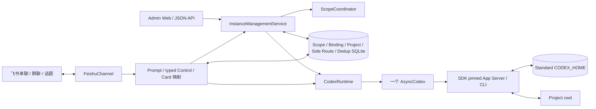

# Netizen Python Pilot 设计

## 目标与边界

目标是让少量受信用户在一台云主机上，通过飞书单聊、群聊和话题使用原生 Codex。
飞书只是新的 Channel；历史、工具、Skills、MCP、配置、sandbox 和认证仍由 Codex
管理。Project Registry 可通过飞书设置卡片或 Admin Web 管理；当前仍不实现审批卡、Codex 原生配置
值的 idle read/update、文件/音视频作为 prompt 输入、流式 token、HA 或
durable queue。普通 Turn 的结构化本轮文件可在终态卡片中按需发送；普通图片
和富文本图片按 [ADR 0015](adr/0015-support-native-image-inputs-for-message-and-quote.md)
作为原生视觉输入支持。

## 架构

业务只有一个 Python 服务。Admin listener 和 `FeishuChannel` handlers 都运行在 Channel
background loop，且只构造一个 Store、Project Registry、Runtime 与 `AsyncCodex`。App
Server 是 `AsyncCodex` 的子进程，不是第二套业务服务。

## 核心模型

Scope 分为 P2P、群聊主线和真实 topic。Binding 保存本地 UUID、Scope、Project
alias、可空 write-once native Thread ID、可选的 Binding-scoped Model/Effort/Speed
目录 ID、settings revision、creator 和时间；Scope 只保存 active Binding 指针。

`/new <alias>` 命令和零参数 `/new` 的唯一表单都只写 Binding。命令路径把三项留空并
继承 Codex；卡片直接保存三个全有的目录 ID，但不要求任务、不创建 native Thread。
下一条需要启动新 Turn 的普通消息执行：

1. 若有 Binding 配置，在进入 native mutation 前重新调用 live `codex.models()`，按所选
   Model 验证 Effort/Tier 并解析 wire value；
2. lazy Binding 调用 `thread_start(cwd=canonical_project_cwd)` 并 write-once 保存
   Thread ID；已有 native ID 则只 `thread_resume(exact_id)`；
3. `thread.turn(prompt, **override)`，没有 Binding 配置时 kwargs 为空；
4. native handle 返回并完成 ID 校验后保存内存 active Thread/Handle，随后后台轮询公开
   `thread.read()` 的原生状态；Binding 配置不清除，供后续新 Turn 重复使用。

已有 native ID 时只调用 `thread_resume(exact_id)`，不传 cwd、approval、sandbox、
model、config 或 env override。
`thread.turn()` 若没有返回 handle，其副作用结果无法确认：服务立即关闭全部新
admission 并要求重启，不能把 Binding 当 idle 再启动第二轮。

没有 Binding 配置时 `thread.turn()` 不传 `model`、`effort` 或 `service_tier`，由共享
标准 `CODEX_HOME` 的原生 Codex 默认值或既有 Thread 当前设置决定。有配置时，Netizen
在自己启动的每条真实 `thread.turn(input, model=..., effort=..., service_tier=...)`
上重新校验并显式应用。
`/config` 不调用带 override 的 `thread_resume()`，也不声称能读取 Thread 当前值。
模型目录失败、选项下线或不兼容时不会 start/resume/turn，Binding 配置保留供用户重新
配置；`turn()` 返回结果未知时同样保留并关闭 admission。

running Turn 的普通输入仍只调用 exact handle `steer()`：即使 Binding 有配置，也不读取
模型目录或应用它。`/config` 在 running/stopping、Goal active
或 compacting 时明确拒绝。配置 revision 同时进入 submission admission；引用/图片/
Skill 准备期间配置发生变化时，本条消息不执行并要求重发。

每个真实普通或 Side Prompt 在进入 Runtime 前都按
[ADR 0029](adr/0029-project-current-message-provenance-into-prompts.md) 投影 exact Current
Prompt Message。投影使用 Channel SDK 公开的消息 ID、`text/image/post` 类型、内容保真度
和 `Identity` 字段；发送者只作 attribution，不改变 owner、共享控制权、approval 或指令
优先级。[ADR 0030](adr/0030-require-resolved-current-sender-names.md) 开启 SDK 公开的 chat
member roster 姓名补全，并要求当前 sender 具有真实显示名；缺名时在引用读取或图片下载前
零 start/steer，明确提示 `im:chat.members:read`，不再生成“未知发送者”。sender 只投影
`display_name`、应用内 `open_id`、`is_bot` 和 `sender_type`；不把跨应用 `union_id` 或
租户级 `user_id` 写入 Codex 历史。无逐条引用时，
归一化请求正文位于最前，版本化 attribution trailer 位于末尾，且不重复正文；有引用时
使用 v3 JSON envelope，最后的 `current_message.request_text` 保持完整。两者都会作为
native input 进入 Codex 历史，
但不写 Channel Database。来源消息 ID/sender 与同次解析冲突时整条 fail closed。

普通消息开头的连续 `$skill-name` 引用由 Prompt compiler 在当前消息上解析。Runtime
先捕获 exact admission，再按 canonical Project cwd 调用 live `skills/list`；每个名称
必须唯一、enabled 且来自该 cwd 的目录，随后保留原文本并追加公开
`SkillInput(name, path)`。多个 Skill 仍只对应一次 `turn()` 或一次 exact `steer()`；
discovery 期间不持有 Binding 锁，返回后用 admission revision 防止任务状态被重解释。
被引用历史中的 `$` 会在版本化 quote envelope 中编码为非激活文本，不能把历史内容
变成当前 Skill 调用。

已有历史的 idle Binding 可通过 `/compact` 调用公开 `AsyncThread.compact()`。该方法
只立即确认 start；运行时先记录公开 history 中已有 Turn ID，再保留 Binding 的
`compacting` 槽位，直到 `thread.read(include_turns=True)` 出现且仅出现一个新的
terminal `contextCompaction` Turn 且 Thread 回到 idle。首次 idle read 不能单独证明
完成；固定 SDK 的真实探针会观察到 `idle -> active -> idle`。完整决定见 ADR 0013。

`/goal <objective>` 在当前 Binding 上启动原生 persisted Goal。lazy Binding 先创建并
write-once 绑定一个已持久化、idle、非 ephemeral 的零 Turn Thread；若公开 read 不能
证明这一点，Goal 明确不可用。Adapter 返回一个 opaque logical handle，SDK 自己把自动
continuation 的多个物理 Turn 合并为一个通知流。`/goal` 只读展示，`pause/resume/clear`
和 Goal 卡片按钮进入同一 typed control 路由；token budget 暂不暴露。

会话生命周期的命令入口按 [ADR 0017](adr/0017-manage-native-thread-lifecycle.md) 与
[ADR 0019](adr/0019-keep-native-thread-delete-unavailable.md) 管理当前 Binding：
`/rename [name]` 写原生 Thread name；`/archive` 先显示确认卡，提交时再次确认 exact
Binding 仍为 Scope active。归档成功后只清空 active pointer 并保留 Binding/Turn
Settings。`/delete` 只为 Lazy Binding 显示确认卡并删除本地记录；已有原生历史时在任何
native read/mutation 前明确拒绝。
普通 `/sessions` 显式读取 `thread_list(archived=False)`，`/sessions archived` 显式读取
`archived=True`，归档状态与名称都不进 Channel Database。普通列表卡片的“设为当前”只
切换 exact active Binding，不创建 Turn，也不停止其他 Binding 的运行。按
[ADR 0036](adr/0036-archive-exact-idle-sessions-from-the-sessions-card.md)，列表中的 idle
materialized 行可确认后直接 exact archive；inactive 目标保持 active pointer，当前目标
清空 pointer。归档恢复仍显式选择目标：`/unarchive <短 ID>` 或归档卡按钮恢复 exact
native ID 并切换 Binding。

`/side [首轮问题]` 按 [ADR 0021](adr/0021-support-multi-turn-ephemeral-side-topics.md)
从当前 exact active、materialized Parent Binding 创建
`thread_fork(parent_id, ephemeral=True)`。Parent 普通 Turn 正在 running 时允许，
stopping、Goal、compaction、lifecycle unknown、外部 active 或 Lazy Binding 拒绝。
fork 后读取 exact ID/ephemeral/parent shape，并通过固定 Side Adapter 注入不可由用户
修改的边界。Parent active pointer 或配置后续变化不传播到已创建 Side；Side 保存创建
时解析出的 Binding Turn Settings 快照，在同一个 ephemeral Thread 上重复用于后续新
Turn。Parent 和多个 Side 可并发，共享 canonical Project cwd 而不增加 Project 锁。

创建请求先按 `(app_id, source_message_id)` 原子写 `creating` route，再向 underlying
chat fresh send 根卡片。从已有话题触发也不能 reply 当前消息，因此结果是同级 sibling。
若根消息响应已有 `thread_id` 则直接采用；否则对 exact 根消息发送 seed，并固定
`reply_in_thread=True`、`reply_target_gone="fail"`。带首轮问题时，两种返回路径都会
向 exact 根消息发送一条明确标注来源的问题 seed，作为首轮 origin 和 reaction anchor；
展示副本有界并中和飞书 `<at>` 标签，送给 Codex 的原始问题不变。首轮 Current Prompt
Message 始终是原 `/side` 入站消息及其真实发送者，seed 只是 Completion Origin；原 control
即使带普通 reply relation 也不会扩大为逐条引用。无首轮问题且根响应
没有 `thread_id` 时，必要 seed 只提供简短的首条问题引导。每个 send 都校验 raw
message/chat/root/parent/thread 关系、code、分片和 success；来源 topic 与新 topic 相同
时失败。root/seed 使用稳定且互异的确定性 UUID；transport exception 或 retryable result
只以相同 UUID 对账重发一次。目标飞书必须 live 验证重放返回原消息的 exact identity 且不
重复建话题，否则 Side unavailable。公开接口没有 lookup-by-UUID，所以两次响应都丢失时
或服务端接受 fresh root 后进程在持久化 identity 前崩溃，仍可能留下无法由本地 route
发现的 orphan topic；永久墓碑只覆盖已持久化 root/topic identity 的 Side，本地单测不能
消除这个 V1 crash window。首轮问题只在新话题显示并执行；Parent 创建成功后不发文字回复，
错误仍在来源位置明确报告。

Side Topic route 不是新的 ScopeKind。消息先按 exact topic ID 查 Side，再按 inbound
root ID 回退，只有未命中才进入普通 Scope/Binding。P2P/P2P topic 依据 underlying
`chat_type=p2p` 免 @；群主线和各类群话题仍逐条要求 @。`closed/expired/failed`
墓碑永不转成普通 Binding；open route 缺少内存 Session 时立即转 expired。

## 运行与锁

内存状态以 Binding ID 为键：普通 Turn 保存 handle、owner、origin message、
running/stopping、completion task、receipt Event、只读 plan cursor/checklist、成功
steer count 与 freshness；原生压缩保存 exact Thread、
baseline Turn ID、compacting task 和 receipt Event；Goal 保存一个
`starting/running/pausing/external-active/unknown` 的逻辑操作槽、opaque handle、
persisted snapshot、cleanup barrier 与 receipt Event。Scope 锁只保护
new/resume/active pointer 与 stale lifecycle 卡片校验；Binding 锁保护首次 start、
steer、stop、compact、短暂的 rename/archive/Lazy delete/unarchive lifecycle 槽和 terminal
cleanup。不同 Binding 不互锁，也没有全局/Project semaphore。

普通持久 Thread 的连接订阅按 [ADR 0028](adr/0028-release-idle-persistent-thread-subscriptions.md)
由 Runtime 保存瞬态记录。当前 active Binding 每次原生操作精确回到 idle 后保留十五分钟
warm window；切换 `/new`、`/resume` 或 archive/unarchive 使某个 idle Binding 不再 active
时立即尝试取消其订阅。策略没有 Thread 数量上限或 LRU，不扫描 SQLite，也不在进程重启
时 resume Thread 或重建 timer；新进程从零条已知订阅开始。下一条消息仍用保存的 exact
native ID 公开 resume，因此 Binding、历史与 Turn Settings 都不变。

释放 timer 不计入普通 `wait_idle()`，但与对应 Binding 的 start/resume、active pointer
变化及终态在同一锁和 generation 下防止 ABA。pointer 已持久化变化后先保护新的 current，
timer 也会复核它是否由 inactive 变成 current，过期的 inactive 策略不能释放新 current。
到期后必须再次公开 read exact Thread，且只有 `idle`、没有普通 Turn/Goal/compaction/
lifecycle 槽、没有 App Server 登记的后台 terminal 时才 unsubscribe。公开 read 返回
`notLoaded` 不是 unsubscribe 成功证据。检查失败、external active、未知状态或存在
terminal 都保留订阅并等待新的完整空闲窗口；unsubscribe unknown 在成功 exact resume 或
确认 unsubscribe 前始终保持 unknown。自动释放绝不 cleanup、terminate 或 signal 进程。
shutdown 先禁止新 timer，取消并排空已有 timer，再关闭 Codex transport。

`thread/unarchive` 只恢复归档 rollout；Runtime 随后必须 exact `thread_resume`，并只用
resume 返回的 handle 建立订阅记录。`/release` 只显式释放当前 active 普通 Binding 的当前
连接订阅；Lazy Binding 或本来未订阅是幂等成功，busy、后台 terminal 与状态未知都明确
拒绝。`/status` 展示的也只是本 Netizen
进程的瞬态订阅投影。`unsubscribed`、`notSubscribed` 或 `notLoaded` 不表示 Thread 被删除，
也不表示 writer 立即释放：最后一个订阅者离开后，App Server 仍要求连续三十分钟没有订阅
和活动才会卸载 Thread。

Side 另有以 Side ID 为键的内存 Session registry 和独立锁/admission revision；它不占用
Parent Binding 的 active 槽。idle 消息对同一 ephemeral `AsyncThread` 新建 Turn，running
消息只 steer exact handle。引用、图片和 Skills 准备前捕获 Side revision，提交时防止
close/expiry 或 idle -> running -> idle ABA。Side 内只允许 Prompt、`//`、`/status`、
`/stop`、`/help`、`/` 和 `/side close`，其他 Binding lifecycle/config/Goal control 和
嵌套 Side 均拒绝。`/stop` interrupt/clean 当前 Side Turn 后仍回到 idle，可继续多轮。

Side idle 两小时后过期；active Turn 完成后重新开始完整窗口。长期 timer 不进入普通
`wait_idle()` task set。close 在 Side 锁内先切 `closing` 并快照 active，释放锁后才
interrupt 并等待 `handle.run()` 的 exact terminal evidence，再对 exact Side Thread
terminal cleanup 和 unsubscribe。interrupt 成功不是前台终态证明，drain timeout 仍保留
non-admitting Session 与非 terminal route。已知 handle 的 interrupt/cleanup/unsubscribe
结果未知可由 close/shutdown 重试；`turn/start` 响应或 `handle.run()` 终态未知则关闭全服务
native admission，要求 transport 重启，且不得 cleanup/unsubscribe 后伪造 terminal route。
全部确认后才写 closed/expired/failed 墓碑并清 registry。shutdown 在 Codex transport close
前并发执行所有普通/Goal/Side cleanup。

running 时普通消息调用同一 handle 的 `steer()`；stopping 明确拒绝。steer 若恰好
撞上完成，只提示重发。`/stop` 在 Binding 锁内先 interrupt 当前 active handle，再
通过 ADR 0009 的窄 adapter 请求清理 App Server 为同一 native Thread 登记的后台
终端。只有两步 RPC 都成功才由原任务回复中断终态；cleanup 请求失败时保持 stopping，
重复 `/stop` 只重试 cleanup。按 ADR 0010，成功空响应不证明前台工具进程退出，飞书
终态必须明确提示前台进程可能仍在运行。
Channel 在进入两个 native RPC 之前先有界尝试回复“正在中断当前 Codex Turn”，避免
底层 waiter 挂起时用户无反馈；投递失败不会撤销 stop，成功确认始终早于原任务唯一
的成功/失败终态，不增加 durable delivery queue。
interrupt 报错只代表结果未知，不能恢复 running；重复 `/stop` 会先重试 interrupt。
若精确 native terminal 已被公开 read 确认，而这次重试仍报错，则继续执行 exact-Thread
cleanup，但不把 interrupt RPC 伪装成成功；否则 terminal child 与原 Turn 结果会永久
卡住。
若公开 native read 已经观察到终态而 Binding 仍是 running，则 stop 返回已结束，不
再做 Thread cleanup，避免自然完成竞态误杀后台 terminal。

compacting 时普通 Prompt、引用消息准备、`/config` 和再次 `/compact` 都明确拒绝，
不会 steer、queue 或自动重放。`/stop` 只中断普通 Turn，不声称能终止原生压缩；
`/status` 和 `/sessions` 显示 `compacting`。压缩请求响应或终态未知时保留槽位并关闭
进程级 admission；只有唯一 compaction candidate 的 completed/failed/interrupted 才
释放。`compact()` 的公开 ACK 不含 Turn ID，因此同一 native Thread 在该生命周期内
不支持外部 CLI/App Server 并发写；检测到多个 candidate 必须 fail closed。轮询只在
Thread idle 时读取完整 history，并以 10 分钟为终态上限。

Goal active 时同一 Binding 的普通 Prompt/steer、`/compact`、`/config` 和第二个 Goal
都明确拒绝；其他 Binding 仍可并发。Goal pause 先确认 persisted status 为 paused，再
中断 SDK route 当时给出的 exact 物理 Turn，最后复用 ADR 0009 的 exact-Thread terminal
cleanup。pause、interrupt、cleanup 或 mutation 响应未知时槽位不释放，并按副作用范围
fail closed。只有 SDK logical stream 正常终止、`goal/get` 为非 active、公开 Thread
idle、完整 history 中 exact 最终物理 Turn terminal 四项同时成立，consumer 才释放
槽位并投递一个逻辑终态；单个物理 Turn completed 不代表 Goal 完成。

重启后只通过 `thread/goal/get` 对账 Codex-owned 状态。发现 active Goal 但当前进程没有
安全 route 时标记 `external-active-goal`，拒绝同一 Binding 的 mutation，并提示用户先
在原生 Codex 暂停；不能伪造已丢失的通知、猜测重挂或调用会先 clear 的 start helper。
resume 只允许 persisted paused Goal，并固定执行 register route -> set active -> 等待首个
新物理 Turn。shutdown 不会对 `starting/unknown/external-active` 发起第二套 cleanup；
最终 transport close 后才取消并关闭残留 consumer。

每条普通消息在调用 Codex 前都捕获 admission；逐条引用与图片消息随后再做有界 Channel
读取。为避免准备期间丢失“running 消息 steer exact Turn”或 current Binding 语义，
运行时在 Binding 锁内捕获
`binding_id + admission_revision + exact thread/turn`，不持锁查询飞书，然后在提交
时同锁校验并消费条件。revision 在 start/steer 前、每次 `/stop` 尝试、进入 stopping 和释放
active Turn 时递增，因此 completion、stop、其他 prompt 以及 idle -> running -> idle
ABA 都使延迟输入明确失败，不会转成新 Turn 或 steer 另一 Turn。

穿透 `AsyncCodex` 高层 facade 的兼容边界分为三类，且都复用同一个 App Server，不
启动第二客户端、不扫描或 signal 任意进程。ADR 0009 的 experimental terminal cleanup
固定 method/params/空响应，并继续校验精确 SDK 版本、整个源码包指纹、内部持有类型和
`experimentalApi`；它只覆盖官方登记的 background terminal，空响应不是 foreground
process exit attestation。ADR 0014 的 SDK Gap Adapter 则只为 Goal 与 Skills 暴露
`GoalControl` / `SkillCatalog` 语义口；ADR 0021 同类地只增加 Side 专用的
`SideBoundaryControl.inject_boundary`。ADR 0028 将可复用的
`ThreadSubscriptionControl.unsubscribe` 拆成独立能力：两项都固定 method 和安装 SDK 的 generated model，
不提供通用 request，不维护运行时版本 allowlist。SDK 升级必须通过 per-capability shape、
真实 SDK client synthetic harness 与目标环境 live probe；facade 出现对应公开能力时，
migration sentinel 阻止继续永久保留 shim，并要求逐项切回公开 provider。ADR 0017 的
`ThreadDeleteControl` 在 ADR 0019 下仅保留为非生产 shape/synthetic 迁移哨兵，服务不
构造或注入它。ADR 0020 的 `PinnedTurnPlanObserver` 精确校验 SDK 版本、整包源码指纹、
内部持有类型与 queue shape；它只在 `/status` 或 steer freshness bookkeeping 时，在
router lock 与 exact Queue mutex 下复制 cursor 后的通知引用，不调用 RPC、不注册/注销、
不 `get`/`put`、不新建 worker。rename/archive/unarchive 全部使用高层公开 API。原生名称、
归档状态与 plan 通知仍以 Codex 为事实源，不增加本地 lifecycle 或 progress 状态列。

archive 只允许公开 read 已证明 persisted、non-ephemeral 且 idle 的原生 Thread，并与
普通 Turn、Goal、compaction 和其他 lifecycle mutation 互斥。rename 允许复用当前
Thread handle，但自身同样短暂占槽。已经开始的 mutation 若响应或取消结果未知，保留
`lifecycle-unknown` 并关闭进程级 admission；不能自动重试或把后续 prompt 交给另一
Thread。成功 archive 后不自动选择其他 Binding。Lazy delete 只有本地 Binding mutation；
materialized delete 不进入 Runtime native mutation。

普通持久 Binding 的终态不通过 pinned `handle.run()` 消费。运行时每 0.5 秒用
`thread.read(include_turns=False)` 读取轻量 Thread status；`notLoaded` 和 `active`
继续等待，只有 `idle` 才调用 `include_turns=True` 并选择 exact Turn ID；
`systemError` 或未知状态显式失败。新 rollout 短暂为空时公开 API 可能返回
`InternalRpcError`，保持 Binding active 并重试。SDK 公开判定为 retryable 的
overload 也走相同路径。真实 App Server 还可能先报告 `idle`，随后短暂拒绝
`includeTurns`；只对当前 Thread 精确匹配的 `not materialized yet` 错误重试，其他
`InvalidRequestError` 立即失败。若 idle 后 exact Turn 尚未出现或仍是 inProgress，
full-history 重读退避到 2 秒。completed 状态还可能短暂先于 final agent message 可见；
普通 Turn 最多再做 4 次 full-history 读取（默认约 2 秒），期间已标记 terminal 以避免
`/stop` 误中断，仍无文本时保留显式无文本兜底。completed/failed/
interrupted 和 final agent message 都来自 SDK 的公开 native Turn 模型，不创建
外层 Turn 记录。

普通 Turn completed 后按 [ADR 0024](adr/0024-send-structured-turn-files-from-completion-cards.md)、
[ADR 0025](adr/0025-use-turn-provenance-not-project-containment-for-files.md) 与
[ADR 0027](adr/0027-use-turn-diff-and-self-contained-file-cards.md)，优先解析该 exact Turn
最新公开 `turn/diff/updated.diff` aggregate snapshot，再用 completed `fileChange`
add/update/move 与 `imageGeneration.saved_path` 补充。unified diff 只读 file metadata，
支持 delete 排除、rename、binary 和 Git quoted path，不读 hunk 正文。Project 仅作为
相对路径解析基准，不是文件授权边界；absolute 或 `..` 路径当前解析为普通文件时同样
可用。访问权限仍由原生 Codex sandbox/approval 决定。canonical 重复、缺失、目录和设备
文件被忽略；不扫描目录、不解析最终文本，也不推断没有进入 Turn diff/items 的
shell/MCP/第三方工具输出。没有可用文件时仍发送原纯文本；存在文件时只发送一张包含最终
回复与“本轮文件”的 Card 2.0。Goal、Side、compaction、失败和中断终态不进入这条路径。

新 v4 卡片每页 8 个，最多 500 个完整循环分页，展示总数、页码、脱敏逻辑位置与当次读取的
大小；Project 内文件使用 Project 相对路径，Project 外原生生成图使用
`生成图片/<文件名>`，账号 home 内其他文件使用 `~/...`，其余位置只显示有界路径尾部。
不使用表格、预览、diff、发送全部或静默截断；超过 500 个或完整 JSON 超过 55,000 bytes
时明确说明平台边界。可见正文不显示绝对路径，但每个发送 callback 明文携带该文件
canonical absolute path；每页唯一的“下一页/回到第一页”循环 callback 明文携带完整
`{path,label}` manifest 和原最终回答。Binding/Turn 只保留 provenance 和幂等 identity；
v4 callback 不读取飞书原卡、Binding、Project 或 completed Turn，直接重建并更新完整
Card 2.0。清单、卡片 session、内容和快照都不作为会话状态留在进程内存或 SQLite，
因此服务/App Server 重启后已发送的 v4 卡片仍能工作。本轮文件 callback 只接受 v4；
旧 v3 opaque-ref 卡片点击时明确提示已过期，不再重读历史。

每次翻页和发送都从 payload path 重新 resolve/stat；不可用文件在分页中保留位置并取消
发送按钮。图片白名单为 PNG/JPEG/GIF/WebP，点击后用 `OutboundImage`；其他普通文件用
`OutboundFile`。两者都通过 callback source card 的 exact message ID 执行
`reply_in_thread=True`、`reply_target_gone="fail"`。平面卡片由此成为话题锚点，既有话题
中的卡片必须留在原 topic；响应须确认 chat/thread 与非空 root/parent。普通回复树可能
保留更早的 `root_id`，因此不能用 `root_id == card_id` 猜话题。重复点击
复用确定性 UUID。文件已变化或同一路径已重绑时发送点击时当前普通文件，不承诺 Turn
完成瞬间版本；文件消失、变成非普通文件、关系异常或发送失败时保持原卡，并尽力在卡片
话题回复错误，不降级到主聊天。

ephemeral Side 明确不复用上述持久 history recovery：consumer 只调用公开
`AsyncTurnHandle.run()`，不保存 completion cursor、不轮询 Side history，也不增加
release gate。产品接受极快 Side Turn 可能遇到 `turn/completed` 通知竞态；这个豁免不
删除或放宽普通持久 Thread 的现有恢复和 release probe。

原生终态一到通常立刻删除 active 状态，然后等待原消息首次运行态 reaction 尝试的
Event，最后投递结果。Channel 按 exact Turn ID 在内存管理原消息与两个当前 reaction ID：
`Typing` 从开始到终态常驻，`THINKING` 首次显示 2 秒、隐藏 13 秒后继续低频 pulse；每次
删除只使用创建响应返回的 exact ID。单次 `THINKING` 添加/删除失败停止该轮 pulse，终态
或正常 shutdown 对仍记录的 ID 再做一次尽力清理，不会重试风暴或阻塞 Turn。若
`THINKING` 首次添加失败，仍保留已经添加的 `Typing` 作为运行占位。若本地 stop 的 cleanup
请求失败，终态暂不释放 active：它等待重复 `/stop`
成功后再完成，避免同一 Binding 在已登记后台终端状态未知时开始下一 Turn。cleanup
成功后仍不推断前台工具进程状态。首次表情回执放在 `try/finally`，所以发送失败也不会
把已启动 Turn 卡死。成功 steer 不迁移或重启原 pulse，只在 steer 消息添加一次 `OnIt`；
确认 reaction 失败才回退一条“已接收调整”，native steer 失败不添加确认。普通 Turn
到达终态后先冻结 pulse 但保留当前运行态表情，再按 completed/failed/interrupted 添加
`DONE`/`ERROR`/`CrossMark`，最后依次移除可见的 `THINKING` 与常驻 `Typing` 并投递最终
文本。所有表情操作均为尽力而为，不把展示失败误报为 Codex 后端失败。强制 kill 可能
留下当时可见的运行态表情；正常终态与正常 shutdown 都会清理，但不为这个展示状态新增
持久化。

首个 real prompt 调用 `thread_start` 后，先把返回的 native ID 原子写入 Binding，再
发送首 Turn；写入失败或冲突时关闭新 admission，且不发送 prompt。每次 cleanup 前还
会核对 handle Thread ID、`AsyncThread.id` 与 Binding 的 write-once native ID；若
handle 回报不同 ID，关闭 admission 且不对不可信 handle 执行 interrupt/cleanup。

## 数据与配置

`channel.sqlite3` 只有 `schema_version`、`scopes`、`bindings`、`projects`、
`side_topics`、`dedup_keys`。最后一张表直接实现 Channel SDK 冻结的 `seen/mark`
DedupStore 协议。Schema v5 的 `bindings` 保存全空或全有的三个 Binding-scoped catalog
ID、settings revision 和 rollback-compatible `ever_activated` 标记；旧行/default 仍为 1，
Admin 仅创建且从未设为当前的 Lazy Binding 为 0，第一次 active-pointer 提交由 trigger
原子改为 1。`side_topics` 保存 app/chat/topic/root/source、Parent Binding
ID、creator、mention policy、creating/open/closed/expired/failed 和时间，不保存
ephemeral native Thread ID 或内容。服务只接受当前 schema，不承担旧 Channel Database 的自动迁移；
没有历史 Side 的首次 v4 -> v5 Pilot 升级可归档旧数据库后重建；v5 之后的升级必须迁移或
等价保留 `side_topics` 永久墓碑，不能把旧 Side 话题重新开放为普通 Binding。它不保存
解析后的 wire value 或已生效配置。
数据库没有 prompt、当前消息发送者投影、回复、ephemeral native Thread ID、Turn、Goal、
Skill catalog、plan/checklist、reaction、cwd
副本、本轮文件清单/快照/摘要、card session、Codex config、Thread name/archive 状态或
queue 表，也不保存 Admin credential、session、action/CSRF token、native metadata 索引或
audit record。

首次交互安装的飞书应用初始化是 release 外的安装期流程，不是第二个运行时认证层。候选
release 中固定的官方 OpenAPI SDK 用 device flow 创建或从官方页面选择 Bot 应用，并请求
当前能力所需的 tenant scopes、消息事件和卡片回调；已知 App ID 配合存在但为空的 Secret
文件时保持 exact identity。有效 App ID 配合不存在的 Secret 文件是显式的 Feishu App
Binding reset：device flow 不绑定旧 App ID，官方页面可选择同一或不同应用，返回身份以
带回滚的配置/凭据更新替换旧绑定。该流程不申请或持久化 user token。成功后只更新同一份
`~/.netizen/config.yaml` App ID 与
`0600` `credentials/feishu-app-secret`，不向 Channel Database、Codex state、环境或日志写入
凭据。安装器在 host mutation/activation 前用官方 scope API 校验同一份 tenant 权限契约；
缺失权限的已有完整凭据只有在 TTY 安装中执行一次 exact-App 修复，无 TTY 直接失败，二者
都不停止旧服务或切换 `current`。手工凭据路径继续等价可用，但不能绕过授权门禁；服务
运行时不进入该流程。App ID 改变后新消息进入新的 Scope namespace；旧 Binding 与原生
历史保留但不迁移。

部署保持一份 release/配置/凭据/数据库/Skill/activation-intent 事务；平台 Service Backend
只负责定义、manager 状态、停止确认、发布、启停、status 与 ready 等待。Linux 使用 systemd
user unit；macOS 14+ 的 Apple Silicon 与 Intel Mac 使用当前 GUI 登录用户的 LaunchAgent，
不增加 LaunchDaemon 或第二个运行时。macOS 只使用 `launchctl print` 退出码判断 loaded，
不解析文本。
launcher 在稳定的 `state/service.lifetime.lock` inode 上持有独占锁，并只为最终 exec 短暂
开放 FD 继承；主进程在导入 SDK 边界前恢复 CLOEXEC。候选回滚只有同时确认 manager target
已卸载且锁已释放时才能恢复 Channel Database/Skill。loaded 与 ready 分离：installer 和
launcher 清理旧 marker，主进程仅在 Feishu background、Runtime 与 admission 全部开启后原子
发布 `0600 state/service.ready`，正常退出尽力删除。
macOS 应用入口通过精确锁定的 `truststore` 使用 Security.framework 的系统钥匙串验证 TLS；
它不导出证书、不生成 CA bundle，也不增加 Netizen 环境配置。Linux TLS 行为保持不变。

文件数据库使用 WAL、`synchronous=FULL` 和有界 writer busy timeout。Admin 的 keyset
分页查询只通过 Store-owned `query_only` connection 与单 worker executor 执行，SQL 有
progress deadline 和提交前容量门禁；读事务不跨 `await`，也不会让 Web 自己成为第二个
SQLite owner。Project 路径解析、存在性检查和建目录同样进入独立的有界 blocking-I/O
executor。HTTP 断连只丢失响应，已经提交的 mutation/I/O 继续被跟踪到完成或 shutdown
deadline，不据此声称回滚。

Channel SDK 自带的 `ChatQueue` 只按 `chat_id` 串行，会把同一个话题群里的独立 topic
错误地互相阻塞，因此 Pilot 明确关闭它。消息到达后由 Binding 锁决定 start、steer 或
stopping reject；不同 topic/Binding 不互锁，也不增加 prompt queue。

固定 `lark-channel-sdk==1.2.0` 的 `reply()` 对平面消息不会自动创建话题，且
`SendOpts.reply_target_gone` 默认是 `fresh`。Side 因此只使用公开 `send()`：先 fresh
root，再按需以 `reply_in_thread=True` promotion；promotion 固定 `fail`，防止根消息消失
时假成功地降级为主线新消息。未知发送结果只用相同 UUID 做一次有界对账；P2P 建话题、
五类入口的真实返回 shape 以及重复 UUID 的 exact identity 都是部署 live gate。错误 230071
显式失败，单元 Fake 不能替代该验收。

本轮文件按钮也只使用公开 `send()`，但不创建或保存独立 Side route：它对 callback
source card 固定 `reply_in_thread=True` 与 `reply_target_gone="fail"`。平面卡片响应必须
返回非空 thread 且确认该卡片的 parent 关系；已有 topic 卡片必须返回同一个 thread ID，
并接受飞书把 root/parent 归一到既有话题根。发送
UUID 由卡片、sender、Binding、Turn、动作和 v4 absolute path 确定，重复 callback
不生成新的本地幂等状态。v4 分页只从 callback 恢复回答、清单
和目标页，再用公开 `update_card()` 写回完整 Card 2.0；不读取 source card，也不在 Channel
Database 或进程内保存 card session。删除卡片、错误 230071 或任何关系不一致
都不允许 fresh fallthrough。

固定 `lark-channel-sdk==1.2.0` 对纯文本话题根消息的 `post` AST 会保留一个渲染后的
机器人 mention，导致命令前多出机器人名称。Channel 边界只修复这个可精确证明的
情况：事件已标记 `mentioned_bot`，公开 bot identity 与首个 AST mention 节点一致，
且当前资源已通过普通/富文本图片准入；不能按名称猜测或剥离其他人的 mention。
文件、音视频等其他附件仍在进入该适配前拒绝。升级 Channel SDK 时必须
重跑根消息契约测试，原生行为修复后删除这段兼容逻辑。

同一固定 SDK 还会丢掉非话题首层引用的 `ReplyRef`，因为它用
`parent_id != root_id` 区分引用。[ADR 0011](adr/0011-support-feishu-quoted-message-context.md)
用精确版本、公开 raw relation 和契约测试恢复这一种首层目标；任何非空
`thread_id` 都优先解释为话题 Scope，不是逐条引用。被引用内容只通过
Channel SDK 公开 typed fetch 读取：文本/富文本/卡片/结构化类型使用归一化
可见文本，合并转发使用 SDK 有界展开；普通 `image` 与 `post` 图片读取真实像素，
其他资源类型只用公开 key 与元数据，
`system`/未知类型 fail closed。卡片归一化只剩占位符时，才使用 SDK 公开
quote-context fallback。锁定 SDK 1.2.0 若对 CardKit 2.0 返回空文本，只在精确
版本门禁和结构/大小/深度边界内，从公共 `QuotedContext.raw` 投影 header/body 的
可见文本节点；按钮值、确认弹窗、选项及事件不进入 prompt。两次 SDK 网络读取
各自具有 10 秒单次请求预算，避免健康请求因共享总预算产生假超时。

引用投影是单层、文本最多 16,000 字符且 mention/资源描述各最多 64 项的 v3
JSON envelope；被引用消息保持 ADR 0011 的宽类型矩阵，当前 `text/image/post` 消息对象及
完整请求始终在最后。飞书应用可用范围与会话成员关系是准入边界，SDK 公共类型中的消息、
会话、mention 和资源 ID 会随引用上下文进入 prompt；发送者身份仅保留 app-scoped
`open_id`，不投影 `union_id`/`user_id`；
raw 事件/card JSON 不会整体复制。被引用消息自己的 reply 只保留公开关系 ID，
不递归读取；图片不保存到 SQLite、文件或长期 cache。超时、撤回、
缺权限、返回 ID/chat 不一致和类型不支持都在 start/steer 前显式拒绝。
引用或图片准备期间若 `/resume`、`/new`、archive/unarchive 改变 Scope 的 current
Binding，已经捕获 admission 的消息也会明确失败并要求重发；它不会继续投递到旧
Binding，更不会被重解释为新 current Binding 的 Turn/steer。

当前消息和被引用消息只要类型为普通 `image` 或 `post`，Channel 边界都会从公开
普通资源描述与 typed `PostContent.post` 当前渲染版本收集真实图片节点，并按
“引用在前、当前在后”的来源 label 转成 Codex 原生
`TextInput/ImageInput` 列表。总计最多 20 张、单图 20 MB、原始字节合计 50 MB；
每条 prompt 内串行下载，单图 10 秒、整批 60 秒，只接受 PNG/JPEG/GIF/WebP magic
bytes。不同 Binding 的图片准备保持并发，不增加全局 gate、semaphore 或 prompt queue。
若 native steer 的等待被取消，Runtime 会先关闭 submission admission，因为底层同步
RPC 可能仍在工作；不能把取消误判为无副作用。
任一图片不可读或越界则整条不 start/steer。下载等待前捕获 submission admission，
所以普通图片与引用查询一样不会在等待后改投另一个 Turn。固定 Channel SDK 会在
调用方校验前完整读取飞书单资源（服务端最高 100 MB），data URL 与 native RPC JSON
还会产生额外副本，且超时不能真正停止已经进入 worker thread 的阻塞读取；并发图片
prompt 会线性放大该风险。Pilot 基于受控用户、低频小图接受这一限制，完整风险和迁移
条件记录在 ADR 0015。群聊/话题 @准入和连续媒体不合并的语义保持不变。

Project 是持久化的 `alias -> canonical absolute cwd`；`none` 映射一个
`defaultCwd`。旧 YAML mapping 只做 `INSERT OR IGNORE` bootstrap；飞书卡片可登记
已有绝对路径，或只在 `projectRoot` 内创建空目录。停用只阻止新 Binding，已有
Binding 仍能继续；Netizen 从不删除目录。它不做 workspace clone 或 Project ACL。
用户和群的准入由飞书应用权限负责；Netizen 和 Channel SDK 不再配置
user/chat/role allowlist。每个被投递到 Scope 的参与者都能管理 Binding、Project 和
停止 active Turn，群聊/话题的消息命令仍逐条要求 @机器人。

Admin Web 是 ADR 0031 的单管理员、实例级控制面，默认监听 `0.0.0.0:8787`。socket 在
Runtime 之前以 closed admission 绑定；Feishu、Store、Runtime 和管理 application 全部就绪
后，主 loop 才通过 `channel.schedule(...)` 在 background loop 打开它并打印 ready marker。
HTTP 使用 exact-pin `h11` 的公开状态机和受限 `asyncio` transport：最多 32 条连接，header
absolute deadline 5 秒、keep-alive 15 秒、request/header line 8 KiB、headers 32 KiB、body
64 KiB，并拒绝 pipelining 和 upload。未认证可读取的内容只有 login、登录页复用的无状态
CSS 与无细节 readiness；未认证 GET `/` 只返回 303 重定向到 `/login`，不返回任何 HTML、
JavaScript 或状态。HTML、JavaScript、API 和其他资源仍要求 session 并返回 401。

Admin credential 来自绝对路径 `NETIZEN_ADMIN_SECRET_FILE`，解码后必须恰好 32 bytes；
最终路径不得是 symlink，文件必须为普通文件且 mode 精确为 0600。认证状态完全在内存：
pre-auth nonce、两小时 idle/十二小时 absolute session、一次性 action/CSRF grant 均有 TTL、
全局/逐来源容量与登录限速；每次认证边界都会检测合法 credential 轮换并清空旧 bearer。
Host 只接受启动时发现的本机地址/名称和 exact port，带 body 的 login 及所有 mutation 还要求
同源 `Origin`，不信任 forwarded header。页面和 API 直接使用受信内网 HTTP，不实现 TLS、
OIDC、多管理员或 RBAC。

Projects、Sessions、Side Topics 都使用服务端 keyset cursor。Binding 查询先在 Channel-owned
索引中过滤 Project、Scope kind、chat/topic/Binding/native ID、Lazy/materialized/current 和
时间，只为当前页读取 native title/preview/catalog 与 best-effort chat label；archived 条件或
Project archived aggregate 需要完整、有 deadline/页数/条目上限的公开 catalog，失败时整次
失败。Sessions 每页只接受 10/20/50/100，默认 20；浏览器用 cursor 栈提供前后翻页，不计算
总数或支持随机页码。Runtime snapshot primitive 仍只接受最多 50 个完整 ID；100 行 Sessions
首屏由 Web adapter 分两批读取，浏览器五秒 polling 同样分片后合并，既不查 native catalog，
也不签发 action token。

chat label 只解析当前页去重后的 `chat_id`。进程级 resolver 使用最多 4096 项的 LRU：成功
结果保留 10 分钟，失败结果保留 30 秒，同 ID 并发请求合并且飞书查询并发最多 10；缓存不写
SQLite，也不预取其他页。群聊和话题群使用公开 chat info 的 `name`/`chat_mode`，P2P 再使用
公开 chat-members 取得唯一真人名称；任一步失败只把该行降级为 ID。UI 分开显示 Scope 的
“消息/话题”、chat mode 的“单聊/群聊/话题群”、Binding 的“当前/非当前”以及 native
archived/missing/Lazy 与运行态。Chat 名称使用飞书 AppLink；话题只打开所在会话，不猜测
未公开的 exact-topic URL。名称与 AppLink 都是当次管理展示事实，不成为 Channel 持久状态。

所有 Web mutation 进入 `InstanceManagementService`，与飞书 controls 共用唯一
`ScopeCoordinator` 和 Runtime exact primitive。每个列表 action 都携带 session-bound、短期、
一次性的 action/CSRF grant，以及 active pointer、Project/settings/activity revision、native
identity 或 Side route identity 等 typed precondition；提交后在锁内重读事实。Admin 可直接
管理 inactive/cross-Scope exact Binding，不靠临时 activate 绕过前置条件；只有显式 activate
或“恢复并设为当前”改变 pointer。Web 不注册 Prompt/Turn、完整 history、Goal mutation、
Compact、materialized delete、Side resume 或批量 native mutation route。

`/settings` 和零参数 `/new` 使用 Card 2.0。Settings 是可扩展的分区界面，当前只
显示已实现的 Projects 分区；分区由版本化回调选择，不保存当前分区或卡片 session。
Projects 不逐行渲染 Registry，而是在一个表单中选择 Project 和启停操作；选项值
携带 alias 与 revision。新增/登记表单与管理表单位于同一卡片，成功或业务错误后均
重绘原 Projects 分区。按钮 value 携带版本化 Scope envelope，回调严格拒绝未知字段
和 stale revision；topic ID 不从 chat ID 推断。Card 2.0 表单 submit 本身不能携带
callback value，因此提交时通过 Channel SDK 的公开
`fetch_message()` 读取原卡片的 `thread_id`，无 topic 时再用公开 `get_chat_info()`
区分单聊和群聊。固定 SDK 在 P2P 上可能返回 `chat_type=unknown`、
`chat_mode=p2p`，因此只从这两个公开字段归一化；查询失败即 fail closed，不增加
card-session 状态。管理表单把 alias 与 revision 编码进静态下拉选项，不依赖固定
Channel SDK 尚未透传的单选 change option，也不读取原始回调。Projects 卡片动作只
执行短 SQLite 事务，不获取 Codex Turn 锁。

`/new` 卡片只有一个 form：Project、Model、Effort、Speed，不显示额外的“配置方式”。
三项默认值来自实时模型目录，提交时全部保存。模型目录不可用时不展示可提交 form，
并提示稍后重试或使用 `/new <alias>` 创建继承 Codex 的会话。提交后只创建 lazy
Binding，并把原卡重绘为包含 Project、会话短 ID、配置摘要和下一步的绿色终态；业务
失败显示红色原因。若公开卡片更新返回失败或抛错，回调在同一聊天或话题回复等价结果，
避免已提交的 Binding 没有反馈。
`/config` 是独立的会话卡片，不属于实例级 `/settings` Projects 分区；它用同一组
Model、Effort、Speed 选择器更新当前 active Binding 的持久配置，不要求任务、不创建
Turn。卡片不显示会话选择或“继承/自定义”模式；配置其他 Binding 必须先 `/resume`
切换。完整 Binding ID 与 settings revision 编码在 Model 选择器不可见的 option value 中，
即使 active Binding 已切换或另一张卡先提交，旧卡也会零 mutation 地失败。

`/sessions` 通过公开、只读且支持分页的
`codex.thread_list(model_providers=[])` 跨 provider 批量读取原生 Thread
元数据；每项优先显示 `name`，未设置时回退到首条用户消息 `preview`，并把短 Binding
ID 保留为 `/resume` 的稳定引用。普通列表呈现为无持久状态的分页卡片：active Binding
置顶并明确标记，其他行用携带完整 Binding ID 和 Scope envelope 的
`binding.activate` 按钮“设为当前”；独立的 `sessions.page` 回调只携带 Scope 与页码。
回调重新读取 live Binding 与 native catalog，通过 Scope coordinator 和 exact
activation 边界校验目标仍属同一 Scope、未归档且仍存在；
成功后原地刷新卡片，多个参与者并发操作时最后一次成功切换生效。该动作不创建 Turn、
不停止旧 Binding 的 running Turn，也不保存 card session；列表缩短时页码夹取到有效页。
呈现为 idle 的 materialized 行还显示带内置确认的 `binding.archive.exact`；动作携带
目标、Scope、当前页和 active pointer 快照，并在共享 Scope 锁内按实时 Runtime 状态重新
校验，并以原生 read 证明 persisted、non-ephemeral、idle。归档 inactive 行不改变真实
active pointer，归档当前行清空 pointer；旧卡、跨 Scope、已归档、外部 active、running、
Goal、compacting 和 lifecycle-unknown 目标均零 mutation 地失败。成功后
从 live catalog 重建并夹取原页；mutation 已确认成功但刷新失败时只回退等价成功消息。
lazy Binding 显示“新会话”且同样可切换。名称和预览只用于当次展示，不写入 Channel
数据库；Thread 列表读取失败或找不到对应 Thread 时明确显示暂不可用，不会为了标题而
resume Thread。切换已成功但后续卡片刷新失败时发送等价成功反馈，不能把已提交 mutation
误报成失败。

`/status` 以一项一行展示当前 Binding、原生 `name`、首条消息 `preview`、Project、完整
native Thread ID、运行状态、当前 active Turn checklist、已接受 steer 次数、上下文窗口
用量、Model、Effort、Speed 和配置来源。名称与
预览中的换行和多余空白会折叠，过长内容有界截断。普通 Turn 保留公开
`thread.read()` 终态恢复；仅当公开 read 确认 exact Turn 曾处于 `inProgress`，才会在
持久化终态确认后通过公开 `AsyncTurnHandle.stream()` 排空该 Turn 已缓存的通知。每次
`thread/tokenUsage/updated` 用 `last.total_tokens` 表示当前窗口已用量，并配合
`model_context_window` 展示上限与百分比；每次 exact `turn/diff/updated` 则整体替换该
Turn 的 latest aggregate diff，只携带到 completion 文件提取。`total.total_tokens` 是累计量，不能冒充当前
窗口。快照只存在于服务内存，不进入 Channel SQLite；lazy Thread、服务重启、固定 SDK
丢失即时完成通知或通知尚未出现时明确显示暂不可用，下一次可观测普通 Turn 完成后更新。
普通后续 Turn 执行期间保留最近完成 Turn 的快照，并在 `/status` 中明确标为“上一轮完成时”；
终态确认后用该 exact Turn 的 usage 通知覆盖；排空结束或失败但没有新 usage 时才使旧快照
失效，因此旧值不会冒充最新完成 Turn。显式压缩、启动/恢复 Goal 或发现外部 active Goal
时仍立即使快照失效，因为这些路径都会改变上下文，却没有同一公开高层 usage 消费面。
终态后排空避免为每条 running Turn 长期占用 SDK 的阻塞 worker；
固定 SDK 可能在通知队列建立前丢失极快 Turn 的 completion，此时不会进入无法安全取消的
stream。terminal metadata stream 失败只影响 usage 展示和 diff 补充；structured items
仍可作为文件 fallback，且 stream 不能取代或削弱 `thread.read()` 的 exact Turn 终态确认。

checklist 来自 App Server 的完整 `turn/plan/updated`，每个有效事件整体替换旧计划，
只接受同时匹配 current `thread_id + turn_id` 的 fixed generated payload。步骤映射为
`✓ completed`、`→ inProgress`、`○ pending`，最多显示 12 项且单步折叠空白后最多 160
字符。成功 native steer 后才增加计数并把已有计划标记为“可能尚未反映最近一次调整”；
steer 请求开始后到达的下一次 exact plan update 清除标记，失败 steer 不更新。没有 plan
时显示 Codex 尚未生成，observer gate 或快照失败时只显示暂不可用。`terminal_observed`
后不再读取或展示这项投影；cursor、步骤、计数与 freshness 仅存在于 `_ActiveTurn` 内存，
不保存历史，不进入 SQLite。observer 不消费通知，终态后的公开 usage stream 仍按原顺序
排空同一队列；plan 展示失败不能改变 Turn、steer、stop、终态和最终回复。

若 Binding 有配置，三项通过 live 模型目录重新解析并标记为“Netizen 会话配置”；目录暂
不可用时回退显示已保存的精确 ID，不让只读状态查询整体失败；目录可用但选项已下线时明确
标记配置失效并引导 `/config`。若没有配置，三项统一显示“继承 Codex”。`thread/read` 不返回
这三项有效值，
这些文案只表达 Netizen 后续新 Turn 的客户端意图，不把模型目录默认值或本地记录伪装成
原生 Thread 实际值，也不新增 Codex-owned 配置副本。

模型、Effort 与加速 Service Tier 不在代码中枚举。卡片可以展示不同模型 Effort/Tier
的并集，但提交必须用新一轮 live catalog 对所选模型重新验证；不兼容或已过期组合
明确失败。固定高层 `models()` 没有 cursor 参数；若响应带非空 `next_cursor`，目录
不完整且无法公开翻页，必须整体拒绝而不是把第一页伪装成完整选项。`default` 是 App
Server 显式回到 Standard 服务层的协议值，其余 Speed
完全来自模型目录。Fast 仍是同一模型的 Service Tier，不能与独立 Codex Spark Model
合并。配置表单携带完整 Binding ID 和 settings revision；若打开后 active Binding 被
`/new`/`/resume` 切换，或配置已被另一张卡修改，本次操作失败。running/
stopping Turn 同样拒绝，不转成 steer、queue 或延迟重放。卡片提交本身没有 Turn
receipt/completion 生命周期；后续普通消息沿用统一的 prompt 表情回执与终态路径。

文本命令由统一注册表记录 owner（Channel/native/hybrid/host）、usage、alias 与能力
状态，`/help` 只从可用条目生成。Model/Effort/Speed 只由 `/new` 和 `/config`
管理；`/model`、`/effort`、`/fast` 不注册。每条飞书消息只解析一个 control 或
prompt，未知 slash command fail closed，不增加任意 `/`/`@` 链式解释器。固定 SDK
的公开 `AsyncThread.compact()` 与公开 history read 满足安全完成条件，因此
`/compact` 可用；CLI/App 的 `/copy`、`/vim`、`/theme`、`/exit` 等纯宿主命令明确
不可用且不进入帮助。

`/rename`、`/archive`、`/delete` 命令只作用于当前 active Binding，不接受目标 ID；管理
另一普通会话的 rename/delete 应先 `/resume`。`/sessions` 中按 ADR 0036 确认归档 exact
idle materialized 行是唯一 archive 例外，不改变 `/archive` 命令。rename 可直接带名称或打开 form；archive 与 Lazy delete 的
callback 携带完整 Binding ID 和 Feishu Scope envelope，并由内置 confirm 二次确认，
其中 delete 使用红色危险卡。materialized `/delete` 不生成卡片，直接说明等待公开 SDK。
提交时 Scope 锁重新检查 active pointer，旧卡片不执行。归档列表只为同一 Scope 的原生
archived Thread 生成恢复按钮；恢复前再次校验 catalog，不把 stale 或跨 Scope Binding
激活。

按 ADR 0018，不注册独立的 `/skills` 浏览 control；用户可用普通自然语言消息询问当前
可用 Skill。显式执行仍是普通消息开头一个或多个 `$skill-name`，并在提交前通过 live
catalog 重新校验。`/goal`、`/goal <objective>`、`pause/resume/clear` 与卡片按钮映射
原生 Goal。一个消息仍只表示一个 control 或一个 prompt，Goal objective 中的 `$skill`
在 live probe 证明语义前明确拒绝。Plan collaboration control 与 Apps discovery 仍
不可用且不进入帮助。

服务使用 effective user 的账号 `HOME` 与 Standard CODEX_HOME（显式 `CODEX_HOME`
优先，否则为 `$HOME/.codex`），并只创建一个 `AsyncCodex`。按 ADR 0023，它通过公开
`CodexConfig` 固定 `allow_login_shell=false`，让工具使用 ADR 0022 已捕获的账号环境，
而不是再以 non-interactive login shell 覆盖 PATH；不传 custom binary/env，也不复制或
修改用户的 `shell_environment_policy`。新 Thread 的公开 API 默认 `auto_review`，不能完整继承
Ask/Custom；其余配置不由 Netizen 覆盖。

release 自带一个原生 `netizen-user-guide` Skill，用于回答飞书中的 Netizen 使用咨询，
不进入 Channel command router，也不替代动态 `/help`。部署只拥有并全量替换
`$CODEX_HOME/skills/netizen-user-guide`；该目录以外的用户 Skill 仍完全由用户维护。
候选 venv 安装不产生这项外部副作用，只有 release 切换时的显式安装步骤会更新全局
Skill，随后重启长期运行的 `AsyncCodex`。固定 `0.147.0` 的黑盒兼容测试必须通过公开
`skills/list(forceReload)` 发现该 `$CODEX_HOME/skills` 路径；SDK 升级不能只根据最新版
文档假定用户 Skill 根目录未变。

Netizen 不监听或复制 Codex 已生效配置；Binding 上只允许 ADR 0016 的持久客户端目录
ID intent。固定 `0.147.0` 的 Linux compatibility probe 用
临时受信任 Project 实测：同一个 `AsyncCodex` 中把 project fallback instruction 从
A 改为 B，下一条新 Thread 直接返回 `CONFIG-B`，重启后仍为 B；全局
`config.toml` 未修改。这是锁定版本的观测值，升级后探针可能分类为
`restart-required`，不泛化为所有用户级键；官方或探针要求重启的设置通过
`systemctl restart netizen` 生效。

仓库锁定的 `openai-codex==0.147.0` 已公开 `models()`、Turn 级三项 override、
`compact()`、persisted Thread read、Thread rename/archive/unarchive 与 `SkillInput`，但
没有公开 Thread delete、idle Thread settings read/update、完整 Goal、Plan collaboration
control、Skills/Apps discovery、Side boundary inject、Thread unsubscribe、config 或 MCP
的高层方法。
ADR 0014 只为 Goal/Skills
使用生产 capability-specific Adapter；ADR 0017 的 Thread Delete Adapter 按 ADR 0019
保持 dormant；ADR 0021 的 Side boundary Adapter 只暴露一个固定方法并配合公开 ephemeral
fork；ADR 0028 的 subscription Adapter 由普通持久 Thread 和 Side close 共用。
materialized delete、Plan 与 Apps 均显式 unavailable，`$app` 不被包装成
结构化 attachment。不能增加通用 JSON-RPC gateway。
每次 SDK/App Server 升级先运行 facade inventory、shape/synthetic harness 和
Goal/Skills/Side/lifecycle/release live probes，再重跑 models、compact、completion、steer、
interrupt cleanup、CLI resume 与 Linux compatibility；高层 surface 出现一项就迁移一项。

## 失败语义

- Admin Web 默认开启；credential 非法、静态资源缺失或 bind 失败会使整个服务启动失败，
  不会只保留飞书入口。shutdown 先关闭 Admin listener、Feishu admission 和 Runtime
  admission，再在一个 60 秒 monotonic absolute budget 内排空 handlers/blocking I/O，最后
  interrupt/清理 Runtime、Codex 和 Store；systemd `TimeoutStopSec` 与 LaunchAgent
  `ExitTimeOut` 都以 75 秒外层 deadline 兜底，安装器再以 90 秒完成精确退出确认。
- Admin mutation 发出后遇到 response loss/cancellation 不自动重试。一次性 grant 已消费，
  页面只能刷新对账；若 native 结果未知，沿用相同的 lifecycle/service admission fail-closed
  语义。结构化日志不含 credential、cookie/token、cwd、name/preview 或 request body。
- 没有 durable prompt/final-delivery queue；崩溃后原生历史仍在，但飞书最终回复
  可能丢失。
- CLI 新增消息不回填飞书；飞书 Thread 必须能在 CLI 原生 resume。
- 同用户 Full Access 能读取 Channel DB 和 Secret 文件，这是已接受的 Pilot 风险。
- Python SDK 原生 `handle.run()` 即时 completion race 仍可复现；公开
  `thread.read` recovery 已通过 synthetic 20/20 和真实 Linux 验证，不再阻断部署。
  ephemeral Side 有意只使用 `handle.run()` 并接受同一极快通知竞态，不增加 Side
  recovery；这不改变普通持久 Thread 的门禁。
- Python SDK interrupt 后前台工具进程可能继续运行；ADR 0009 的 experimental clean
  只处理 App Server 已登记的后台 terminal。ADR 0010 将这一项改为显式产品缺口：
  `/stop` 必须警告用户，不得用 cleanup 空响应声称前台进程已停止。精确 Linux 探针
  负责分类并保证不遗留自己的测试进程，结果记录在 `docs/deployment.md`。
- 引用回查是非持久的外部读取；权限、撤回、超时或 exact-Turn 条件变化时，
  当前消息明确失败且不自动重试。群聊引用要求应用额外开启
  `im:message.group_msg`。
- 当前 Prompt sender 姓名由 Channel SDK 的 chat member roster 补全；应用缺少
  `im:chat.members:read`、权限尚未随版本发布或仍无法解析姓名时，当前消息明确失败且
  不调用 Codex。不会使用“未知发送者”占位符继续执行。
- `compact()` 的空响应不是终态；若公开 history 无法确认唯一的新
  `contextCompaction` candidate、出现多个 candidate 或 10 分钟内没有终态，运行时
  保持 Binding reserved 并关闭新 admission，不能把可能仍在压缩的 Thread 当作 idle。
- Goal mutation、通知流或四重终态证据无法确认时保留 Goal slot；可能发生副作用的
  start/resume/clear 会关闭进程级 admission，绝不自动重试。重启后发现外部 active
  Goal 只做只读隔离，当前 SDK 不能安全重挂是显式产品限制。
- Side fork/boundary/topic promotion 失败会保留 creating/failed route 防止落入普通
  Binding；interrupt、terminal cleanup 或 unsubscribe 未确认时保持 closing 且拒绝新
  Prompt，重复 close 只重试未确认步骤。服务重启不恢复 ephemeral Thread，而是在 handler
  注册前把遗留 creating/open route 转为 expired。
- Thread rename/archive/unarchive mutation 一旦开始而结果无法确认，就保留 lifecycle
  slot 并关闭 admission。materialized Thread Delete 在公开 SDK 支持前不会启动；历史
  live gate 已证明固定私有 RPC 可能报错同时产生目录副作用，因此不能重发或猜测成功。
